# HLA imputation report 2025.09.16
## Mendelian errors (trios only)
| HLA | Software | Trios | Errors | Error rate |
| --- | --- | --- | --- | --- |
| A | HIBAG | 54437 | 98 | 0.0018 |
| A | CookHLA | 54437 | 1083 | 0.01989 |
| B | HIBAG | 54437 | 427 | 0.00784 |
| B | CookHLA | 54437 | 1563 | 0.02871 |
| C | HIBAG | 54437 | 310 | 0.00569 |
| C | CookHLA | 54437 | 450 | 0.00827 |
| DPB1 | HIBAG | 54437 | 464 | 0.00852 |
| DQA1 | HIBAG | 54437 | 298 | 0.00547 |
| DQA1 | CookHLA | 54437 | 1588 | 0.02917 |
| DQB1 | HIBAG | 54437 | 256 | 0.0047 |
| DQB1 | CookHLA | 54437 | 2759 | 0.05068 |
| DRB1 | HIBAG | 54437 | 1207 | 0.02217 |
| DRB1 | CookHLA | 54437 | 3302 | 0.06066 |
## HIBAG/CookHLA consistency check
### Number of samples with 0, 1 and 2 inconsistent alleles between HIBAG and CookHLA
| HLA | 0 | 1 | 2 |
| --- | --- | --- | --- |
| A | 208116 | 20255 | 606 |
| B | 204725 | 23000 | 1252 |
| C | 217475 | 11199 | 303 |
| DQA1 | 141718 | 76662 | 10597 |
| DQB1 | 171901 | 53253 | 3823 |
| DRB1 | 170391 | 54354 | 4232 |
### Aggregated single inconsistency counts per allele (rows = HIBAG, columns = CookHLA)
### HLA-A
|   | 01:01 | 02:01 | 02:05 | 02:06 | 03:01 | 11:01 | 23:01 | 24:02 | 24:03 | 25:01 | 26:01 | 29:02 | 30:01 | 30:02 | 31:01 | 32:01 | 68:01 |
|---|------|------|------|------|------|------|------|------|------|------|------|------|------|------|------|------|---------|
| 01:01 | 0 | 58 | 21 | 0 | 11 | 78 | 1 | 6 | 0 | 3 | 1 | 3 | 2 | 1 | 26 | 5 | 3 |
| 01:02 | 49 | 0 | 0 | 0 | 0 | 0 | 0 | 0 | 0 | 0 | 0 | 0 | 0 | 0 | 0 | 0 | 0 |
| 02:01 | 166 | 0 | 79 | 702 | 169 | 94 | 69 | 83 | 1 | 27 | 3 | 29 | 7 | 10 | 73 | 34 | 46 |
| 02:02 | 2 | 6 | 50 | 0 | 3 | 2 | 2 | 3 | 0 | 2 | 0 | 1 | 0 | 1 | 1 | 3 | 1 |
| 02:05 | 1 | 6 | 0 | 0 | 0 | 0 | 0 | 0 | 0 | 0 | 0 | 0 | 0 | 0 | 0 | 0 | 5 |
| 02:06 | 0 | 13 | 0 | 0 | 0 | 0 | 0 | 0 | 0 | 0 | 0 | 0 | 0 | 0 | 0 | 0 | 0 |
| 03:01 | 152 | 65 | 9 | 0 | 0 | 92 | 4 | 11 | 0 | 0 | 0 | 6 | 0 | 7 | 13 | 11 | 9 |
| 11:01 | 32 | 117 | 33 | 0 | 39 | 0 | 7 | 25 | 1 | 0 | 0 | 5 | 1 | 0 | 13 | 4 | 1 |
| 23:01 | 14 | 13 | 0 | 0 | 16 | 6 | 0 | 28 | 9 | 0 | 0 | 1 | 1 | 0 | 1 | 4 | 2 |
| 24:02 | 97 | 303 | 8 | 0 | 823 | 54 | 109 | 0 | 2115 | 8 | 1 | 10 | 1 | 5 | 24 | 24 | 14 |
| 25:01 | 2 | 0 | 0 | 0 | 0 | 1 | 0 | 0 | 0 | 0 | 834 | 0 | 0 | 0 | 1 | 0 | 0 |
| 26:01 | 36 | 77 | 3 | 0 | 48 | 14 | 4 | 13 | 1 | 5664 | 0 | 3 | 3 | 0 | 8 | 9 | 11 |
| 29:01 | 0 | 0 | 0 | 0 | 38 | 0 | 0 | 0 | 0 | 0 | 0 | 532 | 0 | 0 | 5 | 0 | 0 |
| 29:02 | 0 | 0 | 0 | 0 | 9 | 0 | 0 | 0 | 0 | 0 | 0 | 0 | 0 | 0 | 0 | 1 | 0 |
| 30:01 | 0 | 1 | 0 | 0 | 0 | 0 | 0 | 0 | 0 | 0 | 0 | 0 | 0 | 0 | 0 | 1 | 5 |
| 30:02 | 6 | 39 | 2 | 1 | 16 | 4 | 11 | 8 | 0 | 0 | 0 | 2 | 1 | 0 | 2 | 1 | 0 |
| 30:04 | 30 | 50 | 1 | 0 | 37 | 11 | 451 | 16 | 0 | 8 | 0 | 5 | 1 | 0 | 11 | 7 | 14 |
| 31:01 | 7 | 11 | 0 | 0 | 12 | 2 | 0 | 5 | 0 | 0 | 0 | 1 | 0 | 0 | 0 | 2 | 3 |
| 32:01 | 15 | 37 | 2 | 0 | 1 | 3 | 8 | 2 | 0 | 0 | 0 | 1 | 1 | 2 | 0 | 0 | 5 |
| 33:01 | 0 | 0 | 0 | 0 | 0 | 0 | 0 | 0 | 0 | 0 | 0 | 0 | 0 | 0 | 1170 | 0 | 0 |
| 33:03 | 17 | 33 | 4 | 0 | 4 | 7 | 1 | 6 | 0 | 0 | 0 | 0 | 2 | 55 | 913 | 2 | 1 |
| 34:02 | 38 | 76 | 2 | 0 | 54 | 19 | 1 | 19 | 0 | 2 | 0 | 6 | 1 | 1 | 24 | 9 | 11 |
| 36:01 | 3 | 8 | 1 | 0 | 3 | 1 | 4 | 1 | 0 | 0 | 1 | 0 | 3 | 0 | 0 | 2 | 1 |
| 66:01 | 0 | 2 | 0 | 0 | 2 | 0 | 0 | 2 | 0 | 827 | 334 | 0 | 0 | 1 | 1 | 2 | 0 |
| 66:02 | 0 | 0 | 0 | 0 | 0 | 0 | 0 | 0 | 0 | 0 | 0 | 0 | 0 | 0 | 0 | 0 | 1 |
| 68:01 | 6 | 200 | 1 | 3 | 9 | 7 | 1 | 9 | 0 | 0 | 1 | 1 | 1 | 0 | 8 | 4 | 0 |
| 68:02 | 0 | 0 | 0 | 0 | 1 | 0 | 1 | 1 | 0 | 0 | 0 | 0 | 4 | 0 | 0 | 0 | 1110 |
| 69:01 | 2 | 233 | 0 | 0 | 1 | 0 | 0 | 0 | 0 | 0 | 0 | 0 | 3 | 0 | 0 | 0 | 348 |
| 74:01 | 3 | 8 | 2 | 1 | 5 | 2 | 7 | 7 | 1 | 1 | 1 | 2 | 4 | 7 | 4 | 3 | 11 |
| 74:03 | 0 | 0 | 0 | 0 | 0 | 0 | 0 | 0 | 0 | 0 | 0 | 0 | 0 | 0 | 0 | 52 | 0 |
| 80:01 | 0 | 1 | 6 | 0 | 0 | 0 | 2 | 0 | 0 | 0 | 0 | 0 | 1 | 1 | 0 | 1 | 0 |
### HLA-B
|   | 07:02 | 08:01 | 13:02 | 14:01 | 14:02 | 15:01 | 15:10 | 18:01 | 27:05 | 35:01 | 35:03 | 37:01 | 38:01 | 39:06 | 40:01 | 40:02 | 41:01 | 44:02 | 44:03 | 44:04 | 44:05 | 49:01 | 50:01 | 51:01 | 52:01 | 55:01 | 56:01 | 57:01 | 58:01 |
|---|------|------|------|------|------|------|------|------|------|------|------|------|------|------|------|------|------|------|------|------|------|------|------|------|------|------|------|------|---------|
| 07:02 | 0 | 7 | 7 | 6 | 0 | 2 | 0 | 3 | 4 | 2 | 0 | 1 | 0 | 7 | 16 | 9 | 1 | 0 | 3 | 0 | 82 | 1 | 0 | 11 | 0 | 1 | 1 | 0 | 0 |
| 07:05 | 302 | 2 | 2 | 0 | 0 | 6 | 0 | 0 | 1 | 2 | 0 | 0 | 0 | 3 | 7 | 2 | 0 | 5 | 0 | 0 | 0 | 0 | 0 | 1 | 0 | 1 | 0 | 1 | 0 |
| 08:01 | 97 | 0 | 0 | 0 | 0 | 20 | 0 | 86 | 2 | 4 | 0 | 0 | 0 | 0 | 6 | 1 | 0 | 13 | 5 | 0 | 0 | 0 | 0 | 1 | 0 | 3 | 1 | 18 | 5 |
| 13:02 | 77 | 7 | 0 | 9 | 0 | 4 | 0 | 2 | 1 | 0 | 0 | 2 | 0 | 0 | 2 | 1 | 0 | 1 | 0 | 0 | 0 | 2 | 2 | 0 | 0 | 1 | 0 | 3 | 1 |
| 14:01 | 3 | 0 | 0 | 0 | 32 | 2 | 0 | 0 | 0 | 0 | 0 | 0 | 0 | 0 | 0 | 0 | 0 | 0 | 1 | 0 | 0 | 0 | 0 | 0 | 0 | 0 | 0 | 0 | 0 |
| 14:02 | 1 | 3 | 1 | 0 | 0 | 0 | 0 | 2 | 1 | 2 | 0 | 3 | 0 | 1 | 1 | 0 | 0 | 0 | 0 | 0 | 0 | 1 | 0 | 0 | 0 | 1 | 0 | 2 | 0 |
| 15:01 | 22 | 28 | 2 | 6 | 9 | 0 | 1 | 27 | 19 | 119 | 1 | 6 | 2 | 25 | 64 | 9 | 6 | 174 | 16 | 0 | 1 | 5 | 1 | 40 | 7 | 7 | 2 | 12 | 4 |
| 15:02 | 0 | 0 | 0 | 0 | 0 | 125 | 0 | 0 | 0 | 0 | 0 | 0 | 0 | 1 | 0 | 0 | 0 | 1 | 0 | 0 | 0 | 0 | 0 | 0 | 0 | 0 | 0 | 0 | 0 |
| 15:03 | 10 | 1 | 0 | 1 | 0 | 126 | 0 | 1 | 0 | 1 | 0 | 0 | 0 | 0 | 1 | 0 | 0 | 2 | 1 | 0 | 101 | 2 | 1 | 0 | 0 | 1 | 0 | 0 | 0 |
| 15:08 | 0 | 0 | 0 | 0 | 0 | 6 | 0 | 0 | 0 | 0 | 0 | 0 | 0 | 0 | 0 | 0 | 0 | 0 | 0 | 0 | 0 | 0 | 0 | 0 | 0 | 0 | 0 | 0 | 0 |
| 15:10 | 0 | 0 | 0 | 0 | 0 | 31 | 0 | 0 | 0 | 0 | 0 | 0 | 0 | 0 | 0 | 0 | 0 | 0 | 0 | 0 | 0 | 0 | 0 | 0 | 0 | 0 | 0 | 0 | 0 |
| 15:16 | 3 | 1 | 0 | 0 | 2 | 3 | 0 | 0 | 7 | 3 | 0 | 5 | 1 | 85 | 2 | 10 | 0 | 0 | 0 | 0 | 1 | 1 | 0 | 0 | 0 | 0 | 0 | 3 | 0 |
| 15:17 | 0 | 1 | 0 | 0 | 0 | 245 | 0 | 0 | 0 | 0 | 0 | 0 | 0 | 0 | 0 | 0 | 27 | 0 | 4 | 0 | 0 | 0 | 1 | 0 | 0 | 0 | 0 | 0 | 0 |
| 15:18 | 10 | 17 | 3 | 2 | 1 | 87 | 0 | 2 | 6 | 4 | 0 | 0 | 0 | 0 | 12 | 1 | 0 | 124 | 7 | 0 | 0 | 1 | 0 | 259 | 0 | 1 | 0 | 2 | 0 |
| 18:01 | 41 | 16 | 0 | 0 | 2 | 9 | 0 | 0 | 9 | 4 | 1 | 2 | 83 | 0 | 40 | 4 | 1 | 7 | 4 | 0 | 0 | 0 | 4 | 0 | 857 | 7 | 1 | 1 | 0 |
| 18:02 | 0 | 0 | 0 | 0 | 0 | 0 | 0 | 19 | 0 | 0 | 0 | 0 | 0 | 0 | 0 | 0 | 0 | 1 | 0 | 0 | 0 | 0 | 0 | 0 | 0 | 0 | 0 | 0 | 0 |
| 18:03 | 0 | 0 | 0 | 0 | 0 | 0 | 0 | 1 | 0 | 0 | 0 | 0 | 0 | 0 | 0 | 0 | 0 | 0 | 0 | 0 | 0 | 0 | 0 | 0 | 24 | 0 | 0 | 0 | 0 |
| 18:18 | 7 | 5 | 1 | 1 | 2 | 7 | 0 | 1 | 1 | 0 | 0 | 1 | 0 | 1 | 8 | 0 | 0 | 6 | 0 | 0 | 0 | 1 | 0 | 1 | 0 | 0 | 0 | 2 | 0 |
| 27:02 | 0 | 0 | 0 | 0 | 0 | 0 | 0 | 0 | 696 | 4 | 0 | 0 | 0 | 0 | 0 | 37 | 0 | 3 | 0 | 0 | 0 | 0 | 0 | 0 | 0 | 0 | 0 | 0 | 0 |
| 27:03 | 0 | 1 | 0 | 0 | 0 | 0 | 0 | 0 | 0 | 0 | 0 | 0 | 0 | 0 | 1 | 0 | 0 | 0 | 0 | 0 | 0 | 0 | 0 | 0 | 1 | 0 | 0 | 0 | 0 |
| 27:05 | 23 | 26 | 3 | 2 | 7 | 17 | 0 | 6 | 0 | 15 | 0 | 4 | 4 | 20 | 15 | 34 | 0 | 15 | 7 | 0 | 1 | 1 | 0 | 14 | 1 | 5 | 2 | 6 | 1 |
| 35:01 | 236 | 220 | 9 | 10 | 14 | 201 | 0 | 35 | 102 | 0 | 24 | 28 | 10 | 10 | 180 | 30 | 3 | 156 | 42 | 0 | 2 | 11 | 9 | 36 | 3 | 15 | 5 | 40 | 5 |
| 35:02 | 6 | 10 | 1 | 0 | 0 | 9 | 0 | 2 | 4 | 688 | 0 | 2 | 0 | 1 | 4 | 0 | 9 | 10 | 5 | 0 | 1 | 0 | 1 | 3 | 0 | 0 | 1 | 7 | 1 |
| 35:03 | 5 | 11 | 2 | 0 | 2 | 85 | 0 | 7 | 5 | 729 | 0 | 0 | 13 | 0 | 7 | 1 | 0 | 10 | 7 | 0 | 0 | 0 | 0 | 41 | 0 | 2 | 0 | 4 | 0 |
| 35:08 | 0 | 1 | 0 | 0 | 0 | 1 | 0 | 0 | 0 | 919 | 0 | 0 | 1 | 0 | 2 | 0 | 2 | 4 | 0 | 0 | 0 | 1 | 0 | 3 | 0 | 0 | 0 | 0 | 2 |
| 37:01 | 0 | 0 | 11 | 0 | 0 | 0 | 0 | 0 | 10 | 32 | 0 | 0 | 0 | 0 | 0 | 15 | 0 | 0 | 0 | 0 | 0 | 0 | 0 | 2 | 0 | 0 | 0 | 1 | 0 |
| 38:01 | 2 | 7 | 2 | 0 | 1 | 6 | 0 | 4 | 2 | 12 | 1 | 3 | 0 | 6 | 2 | 2 | 1 | 8 | 0 | 0 | 0 | 3 | 1 | 3 | 0 | 1 | 0 | 1 | 1 |
| 39:01 | 15 | 10 | 4 | 0 | 0 | 8 | 0 | 15 | 8 | 18 | 0 | 0 | 1432 | 1411 | 17 | 1 | 1 | 10 | 5 | 1 | 1 | 0 | 1 | 5 | 1 | 22 | 1 | 4 | 0 |
| 39:06 | 2 | 0 | 0 | 0 | 0 | 1 | 0 | 0 | 2 | 0 | 0 | 0 | 0 | 0 | 0 | 0 | 0 | 0 | 0 | 0 | 0 | 0 | 0 | 0 | 0 | 0 | 0 | 0 | 0 |
| 39:24 | 14 | 7 | 0 | 2 | 1 | 5 | 0 | 0 | 3 | 4 | 0 | 0 | 1 | 1 | 5 | 3 | 0 | 4 | 2 | 0 | 0 | 1 | 0 | 4 | 0 | 1 | 0 | 0 | 0 |
| 40:01 | 2 | 3 | 1 | 0 | 0 | 67 | 0 | 32 | 2 | 5 | 0 | 0 | 0 | 0 | 0 | 0 | 0 | 5 | 3 | 0 | 0 | 0 | 0 | 5 | 4 | 1 | 0 | 0 | 0 |
| 40:02 | 1 | 3 | 0 | 0 | 1 | 1 | 0 | 1 | 32 | 10 | 0 | 30 | 0 | 4 | 0 | 0 | 0 | 2 | 0 | 0 | 0 | 0 | 0 | 4 | 0 | 0 | 0 | 0 | 0 |
| 40:06 | 0 | 0 | 0 | 0 | 0 | 0 | 0 | 0 | 1 | 0 | 0 | 1 | 0 | 0 | 0 | 172 | 0 | 0 | 0 | 0 | 0 | 0 | 0 | 0 | 0 | 0 | 0 | 0 | 0 |
| 40:10 | 0 | 0 | 0 | 0 | 0 | 0 | 0 | 0 | 0 | 0 | 0 | 0 | 0 | 0 | 0 | 0 | 0 | 0 | 0 | 0 | 0 | 0 | 0 | 0 | 0 | 1 | 0 | 0 | 0 |
| 40:27 | 0 | 0 | 0 | 0 | 0 | 0 | 0 | 0 | 0 | 0 | 0 | 0 | 0 | 0 | 0 | 0 | 0 | 0 | 0 | 0 | 0 | 0 | 0 | 1 | 0 | 0 | 0 | 0 | 0 |
| 41:01 | 3 | 0 | 0 | 0 | 0 | 9 | 0 | 1 | 1 | 1 | 0 | 2 | 0 | 0 | 5 | 1 | 0 | 0 | 1 | 0 | 1 | 0 | 0 | 1 | 1 | 1 | 1 | 7 | 0 |
| 41:02 | 0 | 0 | 0 | 0 | 0 | 0 | 0 | 0 | 0 | 0 | 0 | 0 | 0 | 0 | 0 | 0 | 897 | 0 | 0 | 0 | 0 | 0 | 0 | 0 | 0 | 0 | 0 | 0 | 0 |
| 42:01 | 1 | 0 | 0 | 0 | 0 | 0 | 0 | 0 | 0 | 0 | 0 | 0 | 0 | 0 | 0 | 0 | 27 | 0 | 0 | 0 | 0 | 0 | 0 | 0 | 0 | 0 | 0 | 0 | 0 |
| 42:02 | 0 | 0 | 0 | 0 | 0 | 0 | 0 | 0 | 0 | 0 | 0 | 0 | 0 | 0 | 0 | 0 | 6 | 0 | 0 | 0 | 0 | 0 | 0 | 0 | 0 | 0 | 0 | 0 | 0 |
| 44:02 | 31 | 35 | 6 | 2 | 0 | 67 | 0 | 12 | 11 | 19 | 1 | 5 | 3 | 3 | 80 | 6 | 0 | 0 | 122 | 0 | 17 | 3 | 0 | 3 | 2 | 0 | 0 | 16 | 0 |
| 44:03 | 32 | 35 | 9 | 4 | 4 | 41 | 0 | 9 | 23 | 38 | 3 | 7 | 4 | 1 | 26 | 13 | 1 | 20 | 0 | 131 | 1 | 36 | 7 | 31 | 12 | 11 | 6 | 10 | 16 |
| 44:05 | 0 | 0 | 0 | 0 | 0 | 0 | 0 | 0 | 0 | 1 | 0 | 0 | 0 | 0 | 0 | 0 | 0 | 28 | 1 | 0 | 0 | 0 | 0 | 0 | 0 | 0 | 0 | 0 | 0 |
| 45:01 | 4 | 4 | 1 | 0 | 1 | 7 | 0 | 3 | 2 | 1 | 0 | 0 | 1 | 3 | 2 | 0 | 0 | 15 | 303 | 14 | 0 | 2 | 1479 | 0 | 0 | 2 | 0 | 5 | 0 |
| 46:01 | 0 | 0 | 0 | 0 | 0 | 104 | 0 | 0 | 0 | 0 | 0 | 0 | 0 | 3 | 0 | 0 | 0 | 0 | 0 | 0 | 0 | 0 | 0 | 0 | 0 | 0 | 0 | 0 | 0 |
| 47:01 | 150 | 246 | 17 | 15 | 21 | 143 | 0 | 33 | 81 | 74 | 6 | 15 | 6 | 5 | 113 | 24 | 2 | 129 | 34 | 0 | 2 | 19 | 11 | 44 | 7 | 13 | 4 | 94 | 1 |
| 48:01 | 123 | 80 | 14 | 134 | 243 | 50 | 0 | 24 | 51 | 27 | 0 | 17 | 4 | 6 | 4 | 3 | 0 | 33 | 12 | 0 | 0 | 2 | 2 | 9 | 0 | 4 | 11 | 14 | 0 |
| 49:01 | 2 | 2 | 2 | 0 | 0 | 2 | 0 | 2 | 1 | 1 | 0 | 1 | 1 | 0 | 0 | 0 | 0 | 0 | 2 | 0 | 0 | 0 | 1 | 1 | 1 | 0 | 1 | 0 | 2 |
| 50:01 | 13 | 21 | 0 | 1 | 0 | 24 | 0 | 2 | 5 | 5 | 0 | 2 | 0 | 1 | 7 | 2 | 1 | 31 | 8 | 0 | 0 | 32 | 0 | 6 | 0 | 1 | 0 | 1 | 0 |
| 51:01 | 55 | 34 | 5 | 1 | 6 | 341 | 0 | 12 | 12 | 29 | 62 | 3 | 5 | 6 | 40 | 8 | 172 | 69 | 651 | 0 | 0 | 3 | 0 | 0 | 54 | 4 | 2 | 8 | 2 |
| 51:05 | 0 | 0 | 0 | 0 | 0 | 0 | 0 | 0 | 0 | 1 | 0 | 0 | 0 | 0 | 0 | 0 | 0 | 0 | 0 | 0 | 0 | 0 | 0 | 0 | 0 | 0 | 0 | 0 | 0 |
| 51:07 | 0 | 0 | 0 | 0 | 0 | 0 | 0 | 0 | 0 | 0 | 0 | 0 | 0 | 0 | 0 | 0 | 0 | 0 | 0 | 0 | 0 | 0 | 0 | 7 | 0 | 0 | 0 | 0 | 0 |
| 51:08 | 0 | 0 | 0 | 0 | 0 | 0 | 0 | 0 | 0 | 0 | 0 | 0 | 0 | 0 | 0 | 0 | 0 | 0 | 41 | 0 | 0 | 0 | 0 | 3 | 0 | 0 | 0 | 0 | 0 |
| 52:01 | 0 | 0 | 0 | 0 | 0 | 0 | 0 | 0 | 0 | 0 | 0 | 0 | 0 | 0 | 0 | 0 | 0 | 0 | 1 | 0 | 0 | 0 | 0 | 35 | 0 | 0 | 0 | 0 | 0 |
| 53:01 | 0 | 0 | 0 | 0 | 0 | 0 | 0 | 0 | 0 | 621 | 0 | 0 | 0 | 0 | 0 | 0 | 0 | 0 | 3 | 0 | 0 | 0 | 0 | 0 | 0 | 0 | 0 | 0 | 2 |
| 54:01 | 0 | 0 | 0 | 0 | 0 | 0 | 0 | 0 | 0 | 0 | 0 | 0 | 0 | 0 | 0 | 0 | 0 | 0 | 0 | 0 | 0 | 0 | 0 | 0 | 0 | 4 | 80 | 0 | 0 |
| 55:01 | 1 | 2 | 1 | 0 | 0 | 0 | 0 | 1 | 0 | 2 | 0 | 0 | 0 | 0 | 1 | 0 | 0 | 1 | 0 | 0 | 0 | 0 | 0 | 0 | 0 | 0 | 137 | 2 | 0 |
| 55:02 | 0 | 0 | 0 | 0 | 0 | 0 | 0 | 0 | 0 | 0 | 0 | 0 | 0 | 0 | 0 | 0 | 0 | 0 | 0 | 0 | 0 | 0 | 0 | 0 | 0 | 0 | 1 | 0 | 0 |
| 56:01 | 1 | 0 | 0 | 0 | 0 | 1 | 0 | 0 | 0 | 4 | 0 | 0 | 3 | 2 | 5 | 0 | 0 | 1 | 0 | 0 | 0 | 0 | 0 | 0 | 0 | 415 | 0 | 0 | 0 |
| 57:01 | 11 | 9 | 2 | 0 | 1 | 31 | 0 | 2 | 6 | 9 | 1 | 0 | 1 | 4 | 40 | 1 | 3 | 14 | 9 | 0 | 2 | 4 | 1 | 25 | 1 | 1 | 2 | 0 | 1 |
| 57:03 | 0 | 0 | 0 | 0 | 0 | 0 | 0 | 0 | 0 | 0 | 0 | 0 | 0 | 0 | 0 | 0 | 0 | 0 | 0 | 0 | 0 | 0 | 0 | 0 | 0 | 0 | 0 | 15 | 0 |
| 58:01 | 0 | 1 | 0 | 0 | 0 | 3 | 0 | 0 | 2 | 732 | 0 | 0 | 1 | 0 | 0 | 0 | 1 | 5 | 2 | 0 | 0 | 1 | 0 | 1 | 1 | 0 | 0 | 3 | 0 |
| 73:01 | 0 | 1 | 0 | 0 | 13 | 0 | 0 | 0 | 0 | 1 | 0 | 56 | 0 | 0 | 0 | 1 | 0 | 0 | 0 | 0 | 0 | 0 | 0 | 4 | 0 | 0 | 0 | 0 | 0 |
| 81:01 | 6 | 0 | 0 | 0 | 0 | 0 | 0 | 0 | 0 | 0 | 0 | 0 | 0 | 0 | 0 | 0 | 0 | 0 | 0 | 0 | 0 | 0 | 0 | 0 | 0 | 0 | 0 | 0 | 0 |
### HLA-C
|   | 01:02 | 02:02 | 03:03 | 03:04 | 04:01 | 05:01 | 06:02 | 06:06 | 07:01 | 07:02 | 07:04 | 08:02 | 12:02 | 12:03 | 14:02 | 15:02 | 16:01 | 17:01 |
|---|------|------|------|------|------|------|------|------|------|------|------|------|------|------|------|------|------|---------|
| 01:02 | 0 | 5 | 15 | 14 | 8 | 6 | 4 | 0 | 20 | 3 | 1 | 0 | 0 | 1 | 4 | 31 | 2 | 0 |
| 02:02 | 14 | 0 | 2 | 6 | 6 | 2 | 1 | 0 | 11 | 8 | 1 | 4 | 1 | 1 | 0 | 1 | 6 | 0 |
| 02:10 | 0 | 137 | 0 | 0 | 0 | 0 | 0 | 0 | 0 | 0 | 0 | 0 | 0 | 0 | 0 | 0 | 0 | 0 |
| 03:02 | 0 | 0 | 755 | 63 | 3 | 0 | 0 | 0 | 0 | 2 | 0 | 0 | 0 | 0 | 0 | 0 | 0 | 0 |
| 03:03 | 0 | 4 | 0 | 1160 | 3 | 1 | 0 | 0 | 1 | 0 | 1 | 0 | 0 | 0 | 0 | 0 | 0 | 0 |
| 03:04 | 1 | 3 | 617 | 0 | 18 | 4 | 1 | 0 | 6 | 0 | 0 | 0 | 1 | 2 | 1 | 7 | 0 | 0 |
| 03:05 | 0 | 0 | 0 | 11 | 0 | 0 | 0 | 0 | 0 | 0 | 0 | 0 | 0 | 0 | 0 | 0 | 0 | 0 |
| 03:10 | 0 | 0 | 283 | 135 | 0 | 0 | 0 | 0 | 0 | 0 | 0 | 0 | 0 | 1 | 0 | 0 | 0 | 0 |
| 04:01 | 0 | 55 | 5 | 42 | 0 | 43 | 5 | 0 | 47 | 20 | 1 | 10 | 43 | 1 | 0 | 3 | 192 | 24 |
| 04:03 | 0 | 0 | 0 | 0 | 0 | 0 | 0 | 0 | 8 | 0 | 0 | 0 | 0 | 0 | 0 | 0 | 0 | 0 |
| 05:01 | 0 | 2 | 0 | 6 | 0 | 0 | 1 | 0 | 19 | 2 | 1 | 25 | 0 | 0 | 0 | 0 | 0 | 0 |
| 06:02 | 0 | 1 | 0 | 1 | 4 | 2 | 0 | 3476 | 75 | 1 | 1 | 6 | 0 | 11 | 4 | 0 | 3 | 0 |
| 07:01 | 2 | 8 | 1 | 4 | 5 | 1 | 1 | 0 | 0 | 24 | 1 | 1 | 0 | 0 | 0 | 0 | 0 | 2 |
| 07:02 | 0 | 0 | 0 | 3 | 14 | 0 | 1 | 0 | 22 | 0 | 0 | 1 | 0 | 0 | 0 | 0 | 0 | 0 |
| 07:04 | 0 | 16 | 0 | 1 | 1 | 0 | 2 | 0 | 1 | 18 | 0 | 0 | 0 | 1 | 0 | 3 | 0 | 0 |
| 08:01 | 0 | 0 | 0 | 0 | 0 | 170 | 0 | 0 | 0 | 0 | 0 | 346 | 0 | 0 | 0 | 0 | 0 | 0 |
| 08:02 | 0 | 0 | 0 | 0 | 0 | 65 | 0 | 0 | 3 | 0 | 0 | 0 | 0 | 0 | 0 | 1 | 0 | 0 |
| 08:03 | 0 | 0 | 0 | 0 | 0 | 3 | 0 | 0 | 0 | 0 | 0 | 326 | 0 | 0 | 0 | 0 | 0 | 0 |
| 12:03 | 0 | 0 | 0 | 5 | 4 | 2 | 32 | 0 | 19 | 6 | 0 | 0 | 0 | 0 | 0 | 49 | 2 | 0 |
| 14:02 | 10 | 18 | 18 | 49 | 43 | 28 | 23 | 0 | 48 | 53 | 21 | 8 | 0 | 6 | 0 | 5 | 3 | 2 |
| 14:03 | 0 | 0 | 0 | 0 | 0 | 0 | 0 | 0 | 0 | 0 | 0 | 0 | 0 | 0 | 108 | 0 | 0 | 0 |
| 15:02 | 2 | 10 | 215 | 64 | 2 | 2 | 0 | 0 | 4 | 2 | 0 | 0 | 2 | 2 | 2 | 0 | 275 | 1 |
| 15:04 | 0 | 0 | 0 | 0 | 0 | 0 | 0 | 0 | 0 | 0 | 0 | 0 | 0 | 0 | 0 | 77 | 0 | 0 |
| 15:05 | 0 | 0 | 1 | 1 | 4 | 1 | 1 | 0 | 1 | 1 | 0 | 0 | 0 | 0 | 0 | 414 | 1 | 0 |
| 15:11 | 0 | 147 | 0 | 0 | 0 | 0 | 0 | 0 | 0 | 0 | 0 | 0 | 0 | 0 | 0 | 0 | 0 | 0 |
| 16:01 | 0 | 0 | 1 | 12 | 4 | 0 | 0 | 0 | 0 | 0 | 1 | 0 | 0 | 1 | 0 | 0 | 0 | 8 |
| 16:02 | 0 | 0 | 1 | 0 | 0 | 0 | 0 | 0 | 0 | 0 | 0 | 0 | 1 | 0 | 2 | 0 | 564 | 0 |
| 16:04 | 0 | 0 | 0 | 0 | 0 | 0 | 0 | 0 | 0 | 0 | 0 | 0 | 0 | 0 | 0 | 0 | 194 | 0 |
| 17:01 | 0 | 0 | 0 | 0 | 1 | 0 | 7 | 1 | 1 | 0 | 0 | 0 | 0 | 0 | 0 | 0 | 1 | 0 |
| 18:01 | 0 | 0 | 0 | 0 | 13 | 4 | 0 | 0 | 0 | 0 | 0 | 1 | 0 | 0 | 0 | 0 | 0 | 0 |
### HLA-DQA1
|   | 01:01 | 01:02 | 01:03 | 02:01 | 03:01 | 04:01 | 05:01 |
|---|------|------|------|------|------|------|---------|
| 01:01 | 0 | 85 | 1 | 3 | 3 | 5 | 5 |
| 01:02 | 167 | 0 | 1113 | 279 | 101 | 21 | 872 |
| 01:03 | 95 | 2358 | 0 | 170 | 125 | 23 | 850 |
| 01:04 | 7291 | 249 | 26 | 3 | 13 | 2 | 24 |
| 01:05 | 3258 | 60 | 7 | 1 | 2 | 1 | 3 |
| 02:01 | 5 | 117 | 5 | 0 | 74 | 97 | 62 |
| 03:01 | 1 | 11 | 2 | 1 | 0 | 359 | 70 |
| 03:02 | 88 | 598 | 81 | 2024 | 405 | 395 | 1252 |
| 03:03 | 32 | 75 | 25 | 39 | 23865 | 344 | 192 |
| 04:01 | 1 | 3 | 0 | 4 | 29 | 0 | 1 |
| 05:01 | 12 | 1559 | 504 | 83 | 183 | 10 | 0 |
| 05:03 | 0 | 0 | 0 | 0 | 0 | 0 | 27 |
| 05:05 | 155 | 253 | 64 | 300 | 768 | 34 | 24198 |
| 05:09 | 0 | 0 | 0 | 0 | 54 | 0 | 0 |
| 06:01 | 6 | 11 | 7 | 218 | 221 | 125 | 397 |
### HLA-DQB1
|   | 02:01 | 02:02 | 03:01 | 03:02 | 03:03 | 03:05 | 04:02 | 05:01 | 05:02 | 05:03 | 06:01 | 06:02 | 06:03 | 06:04 | 06:09 |
|---|------|------|------|------|------|------|------|------|------|------|------|------|------|------|---------|
| 02:01 | 0 | 121 | 1754 | 445 | 345 | 0 | 285 | 521 | 5 | 141 | 3 | 1627 | 578 | 61 | 0 |
| 02:02 | 301 | 0 | 350 | 166 | 52 | 1 | 244 | 393 | 1 | 27 | 1 | 1503 | 461 | 32 | 0 |
| 03:01 | 655 | 163 | 0 | 2035 | 615 | 3 | 363 | 740 | 86 | 1922 | 19 | 1906 | 405 | 159 | 0 |
| 03:02 | 1434 | 156 | 429 | 0 | 61 | 42 | 578 | 290 | 0 | 474 | 5 | 1114 | 503 | 55 | 2 |
| 03:03 | 493 | 132 | 1422 | 397 | 0 | 0 | 477 | 274 | 406 | 93 | 8 | 849 | 653 | 153 | 3 |
| 03:04 | 2 | 0 | 118 | 380 | 0 | 0 | 0 | 0 | 0 | 1 | 0 | 3 | 1 | 3 | 0 |
| 03:19 | 0 | 0 | 0 | 0 | 0 | 0 | 0 | 0 | 0 | 0 | 0 | 16 | 0 | 0 | 0 |
| 04:02 | 274 | 11 | 29 | 130 | 5 | 0 | 0 | 73 | 0 | 28 | 1 | 343 | 116 | 75 | 0 |
| 05:01 | 220 | 152 | 292 | 449 | 173 | 0 | 23 | 0 | 3 | 46 | 9 | 1035 | 920 | 47 | 3 |
| 05:02 | 14 | 12 | 352 | 17 | 176 | 0 | 7 | 24 | 0 | 22 | 38 | 43 | 55 | 3 | 0 |
| 05:03 | 49 | 11 | 683 | 1165 | 62 | 0 | 167 | 458 | 4 | 0 | 3 | 399 | 53 | 14 | 0 |
| 05:04 | 22 | 495 | 17 | 0 | 0 | 0 | 1 | 1 | 0 | 5 | 0 | 0 | 1 | 0 | 0 |
| 06:01 | 125 | 34 | 52 | 72 | 20 | 0 | 28 | 8 | 2 | 7 | 0 | 36 | 14 | 2 | 0 |
| 06:02 | 317 | 73 | 897 | 615 | 176 | 0 | 159 | 481 | 5 | 391 | 5 | 0 | 680 | 251 | 0 |
| 06:03 | 747 | 131 | 1657 | 570 | 200 | 0 | 550 | 184 | 43 | 219 | 2 | 2813 | 0 | 91 | 0 |
| 06:04 | 267 | 50 | 766 | 82 | 48 | 0 | 145 | 44 | 6 | 61 | 2 | 941 | 456 | 0 | 6 |
| 06:09 | 100 | 3 | 55 | 33 | 13 | 0 | 6 | 11 | 1 | 0 | 1 | 129 | 21 | 3 | 0 |
### HLA-DRB1
|   | 01:01 | 03:01 | 04:01 | 04:02 | 04:03 | 04:04 | 04:05 | 04:07 | 07:01 | 08:01 | 10:01 | 11:01 | 11:03 | 11:04 | 12:01 | 13:01 | 13:02 | 13:03 | 14:01 | 14:04 | 15:01 | 15:02 | 16:01 |
|---|------|------|------|------|------|------|------|------|------|------|------|------|------|------|------|------|------|------|------|------|------|------|---------|
| 01:01 | 0 | 82 | 38 | 1 | 0 | 41 | 1 | 13 | 50 | 33 | 5 | 20 | 0 | 0 | 10 | 40 | 35 | 3 | 15 | 0 | 167 | 1 | 7 |
| 01:02 | 309 | 208 | 99 | 7 | 5 | 81 | 1 | 17 | 280 | 80 | 174 | 31 | 1 | 1 | 30 | 87 | 81 | 12 | 26 | 2 | 238 | 3 | 9 |
| 01:03 | 3239 | 0 | 3 | 0 | 0 | 6 | 0 | 2 | 5 | 4 | 1 | 19 | 1 | 0 | 3 | 4 | 3 | 0 | 0 | 0 | 9 | 0 | 0 |
| 03:01 | 34 | 0 | 45 | 4 | 0 | 57 | 0 | 4 | 61 | 13 | 5 | 16 | 1 | 0 | 18 | 23 | 33 | 9 | 6 | 1 | 88 | 0 | 3 |
| 03:02 | 6 | 5 | 0 | 0 | 0 | 3 | 0 | 0 | 2 | 43 | 1 | 0 | 0 | 0 | 1 | 0 | 1 | 0 | 0 | 0 | 0 | 0 | 0 |
| 04:01 | 303 | 254 | 0 | 51 | 281 | 18173 | 1 | 206 | 357 | 153 | 32 | 30 | 4 | 3 | 68 | 162 | 163 | 33 | 35 | 3 | 495 | 10 | 15 |
| 04:02 | 3 | 3 | 97 | 0 | 0 | 36 | 0 | 0 | 6 | 182 | 0 | 1 | 0 | 0 | 0 | 0 | 2 | 1 | 0 | 1 | 1 | 0 | 0 |
| 04:03 | 14 | 21 | 1002 | 5 | 0 | 375 | 0 | 21 | 15 | 17 | 5 | 6 | 1 | 0 | 1 | 9 | 7 | 2 | 1 | 0 | 25 | 3 | 0 |
| 04:04 | 6 | 42 | 346 | 86 | 8 | 0 | 0 | 1 | 20 | 52 | 1 | 0 | 0 | 0 | 1 | 6 | 1 | 5 | 4 | 0 | 8 | 0 | 0 |
| 04:05 | 11 | 16 | 247 | 5 | 1 | 1018 | 0 | 1 | 22 | 9 | 2 | 4 | 0 | 1 | 1 | 7 | 7 | 8 | 2 | 0 | 14 | 1 | 0 |
| 04:06 | 2 | 1 | 10 | 0 | 0 | 40 | 0 | 0 | 20 | 86 | 0 | 0 | 0 | 0 | 1 | 0 | 1 | 1 | 0 | 0 | 2 | 0 | 0 |
| 04:07 | 6 | 12 | 620 | 0 | 1 | 72 | 1 | 0 | 14 | 3 | 3 | 0 | 0 | 0 | 0 | 5 | 3 | 5 | 2 | 1 | 8 | 0 | 0 |
| 04:08 | 0 | 1 | 1297 | 1 | 1 | 57 | 0 | 24 | 1 | 1 | 0 | 0 | 0 | 0 | 0 | 0 | 0 | 1 | 0 | 0 | 0 | 0 | 0 |
| 04:10 | 3 | 0 | 0 | 0 | 0 | 2 | 0 | 0 | 4 | 53 | 0 | 0 | 0 | 0 | 0 | 0 | 5 | 0 | 1 | 0 | 5 | 1 | 0 |
| 07:01 | 10 | 16 | 152 | 2 | 0 | 32 | 5 | 18 | 0 | 9 | 1 | 3 | 1 | 0 | 3 | 5 | 1 | 9 | 0 | 0 | 15 | 0 | 0 |
| 08:01 | 1 | 2 | 4 | 0 | 0 | 18 | 0 | 0 | 2 | 0 | 0 | 1 | 0 | 0 | 1 | 0 | 2 | 15 | 0 | 0 | 2 | 0 | 0 |
| 08:02 | 0 | 0 | 0 | 0 | 0 | 5 | 0 | 0 | 1 | 180 | 0 | 0 | 0 | 0 | 0 | 0 | 0 | 1 | 0 | 0 | 0 | 0 | 0 |
| 08:03 | 35 | 9 | 118 | 0 | 1 | 57 | 0 | 3 | 259 | 6 | 1 | 274 | 19 | 2 | 6 | 21 | 7 | 3 | 3 | 0 | 29 | 6 | 0 |
| 08:04 | 0 | 0 | 0 | 0 | 0 | 0 | 0 | 0 | 0 | 214 | 0 | 0 | 0 | 0 | 0 | 0 | 0 | 34 | 0 | 0 | 0 | 0 | 0 |
| 08:10 | 0 | 5 | 2 | 0 | 0 | 6 | 0 | 1 | 0 | 0 | 0 | 58 | 3 | 0 | 0 | 0 | 1 | 0 | 0 | 0 | 5 | 0 | 0 |
| 09:01 | 193 | 183 | 145 | 3 | 0 | 174 | 2 | 13 | 2903 | 123 | 14 | 760 | 4 | 8 | 26 | 89 | 103 | 11 | 41 | 2 | 224 | 8 | 74 |
| 10:01 | 29 | 5 | 4 | 1 | 0 | 3 | 0 | 2 | 10 | 3 | 0 | 2 | 0 | 0 | 1 | 8 | 3 | 0 | 5 | 0 | 20 | 2 | 1 |
| 11:01 | 89 | 297 | 109 | 4 | 1 | 121 | 2 | 58 | 150 | 46 | 9 | 0 | 1459 | 1043 | 37 | 59 | 48 | 48 | 28 | 6 | 118 | 5 | 24 |
| 11:02 | 1 | 5 | 3 | 0 | 0 | 2 | 0 | 3 | 37 | 0 | 0 | 215 | 224 | 2 | 0 | 1 | 0 | 2 | 2 | 0 | 6 | 0 | 0 |
| 11:03 | 0 | 0 | 0 | 0 | 0 | 0 | 2 | 0 | 0 | 0 | 0 | 32 | 0 | 0 | 0 | 0 | 0 | 0 | 0 | 0 | 0 | 0 | 0 |
| 11:04 | 1 | 11 | 2 | 1 | 0 | 3 | 4 | 0 | 5 | 0 | 0 | 1530 | 19 | 0 | 6 | 24 | 2 | 2 | 0 | 0 | 0 | 0 | 2 |
| 12:01 | 30 | 24 | 13 | 0 | 0 | 10 | 0 | 2 | 21 | 12 | 2 | 33 | 5 | 3 | 0 | 19 | 6 | 106 | 2 | 0 | 29 | 0 | 1 |
| 12:02 | 19 | 14 | 5 | 0 | 0 | 65 | 0 | 0 | 19 | 57 | 2 | 27 | 0 | 0 | 0 | 8 | 4 | 2 | 6 | 0 | 13 | 0 | 0 |
| 13:01 | 188 | 3566 | 96 | 1 | 0 | 117 | 0 | 16 | 104 | 73 | 13 | 40 | 1 | 5 | 21 | 0 | 105 | 14 | 51 | 3 | 579 | 3 | 7 |
| 13:02 | 42 | 204 | 22 | 1 | 0 | 12 | 0 | 1 | 27 | 9 | 2 | 2 | 0 | 0 | 3 | 15 | 0 | 6 | 4 | 0 | 43 | 0 | 1 |
| 13:03 | 0 | 1 | 1 | 0 | 0 | 1 | 0 | 0 | 2 | 1 | 0 | 0 | 1 | 0 | 0 | 4 | 2 | 0 | 0 | 1 | 0 | 0 | 0 |
| 13:05 | 0 | 0 | 0 | 0 | 0 | 0 | 0 | 0 | 0 | 0 | 0 | 4 | 0 | 0 | 0 | 0 | 0 | 0 | 0 | 0 | 0 | 0 | 0 |
| 13:17 | 0 | 0 | 1 | 0 | 0 | 1 | 0 | 0 | 0 | 7 | 0 | 0 | 0 | 0 | 0 | 0 | 0 | 0 | 0 | 0 | 0 | 0 | 0 |
| 14:01 | 64 | 40 | 26 | 0 | 0 | 26 | 0 | 3 | 44 | 23 | 9 | 10 | 0 | 0 | 9 | 31 | 22 | 531 | 0 | 217 | 291 | 2 | 5 |
| 14:02 | 0 | 4 | 0 | 0 | 0 | 0 | 0 | 0 | 1 | 0 | 0 | 0 | 0 | 0 | 0 | 0 | 0 | 0 | 0 | 0 | 0 | 0 | 0 |
| 14:04 | 0 | 0 | 0 | 0 | 0 | 0 | 0 | 0 | 0 | 0 | 0 | 0 | 0 | 0 | 0 | 0 | 0 | 0 | 31 | 0 | 0 | 0 | 0 |
| 14:06 | 4 | 21 | 2 | 0 | 1 | 4 | 0 | 0 | 2 | 1 | 0 | 1 | 0 | 0 | 0 | 2 | 0 | 0 | 0 | 0 | 4 | 0 | 1 |
| 15:01 | 57 | 31 | 17 | 1 | 2 | 12 | 0 | 0 | 98 | 11 | 20 | 5 | 0 | 0 | 3 | 96 | 62 | 10 | 9 | 2 | 0 | 14 | 6 |
| 15:02 | 37 | 5 | 1 | 0 | 0 | 1 | 0 | 0 | 61 | 2 | 0 | 0 | 0 | 0 | 0 | 3 | 5 | 0 | 10 | 1 | 3 | 0 | 0 |
| 15:03 | 0 | 2 | 1 | 0 | 0 | 1 | 0 | 0 | 3 | 0 | 0 | 0 | 0 | 0 | 0 | 0 | 3 | 1 | 0 | 0 | 3 | 0 | 0 |
| 16:01 | 11 | 6 | 1 | 0 | 0 | 4 | 0 | 0 | 162 | 4 | 1 | 14 | 0 | 1 | 0 | 2 | 3 | 2 | 6 | 0 | 4 | 14 | 0 |
| 16:02 | 7 | 8 | 4 | 0 | 1 | 0 | 0 | 0 | 17 | 4 | 0 | 3 | 0 | 0 | 2 | 4 | 5 | 4 | 6 | 0 | 7 | 3 | 50 |
## Allele frequencies and probability density plots
### HLA-A
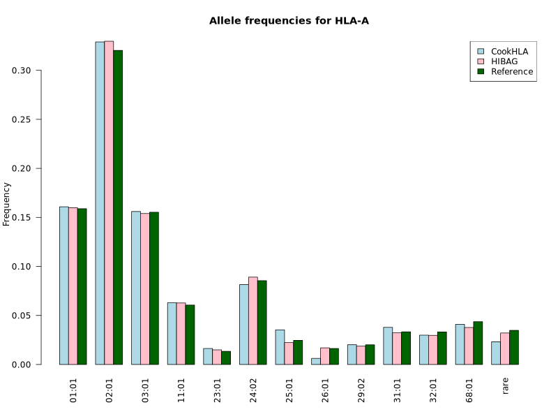
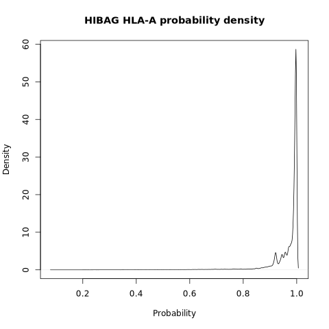
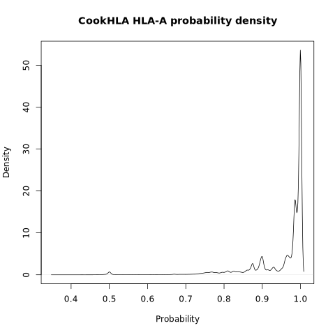
### HLA-B
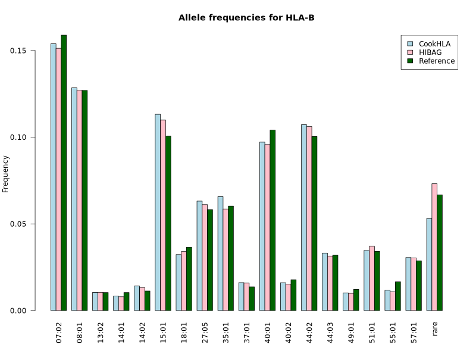
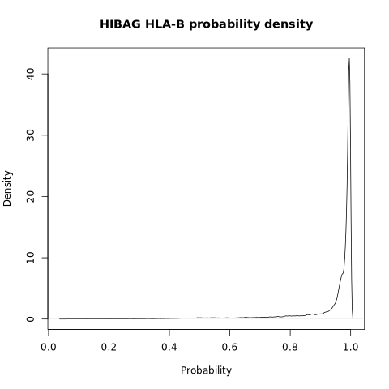
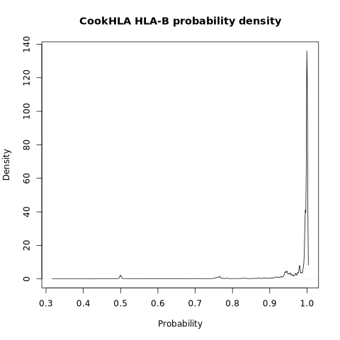
### HLA-C

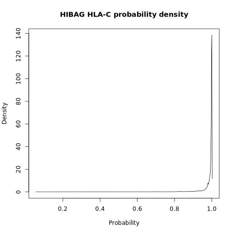

### HLA-DQB1
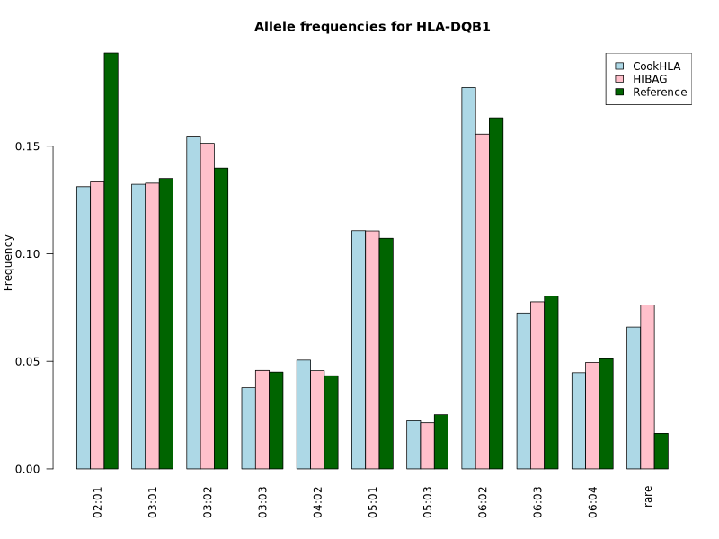
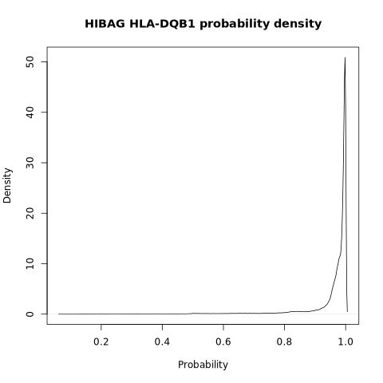
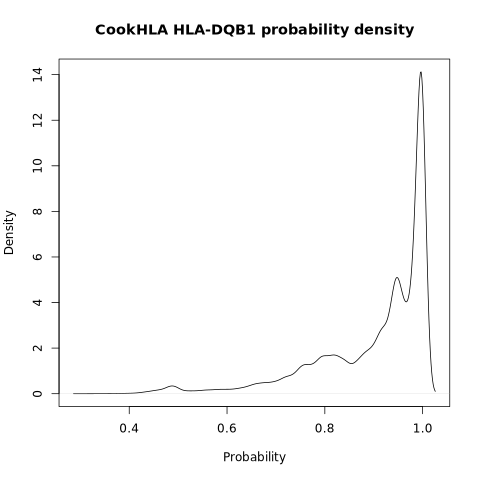
### HLA-DRB1
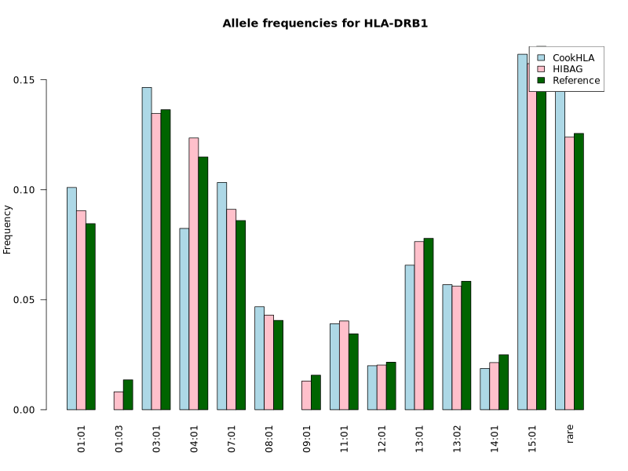
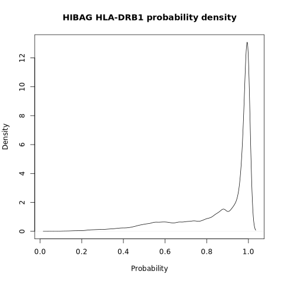
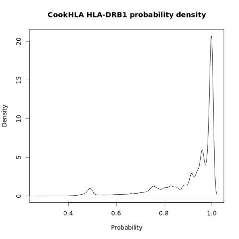
### HLA-DPB1
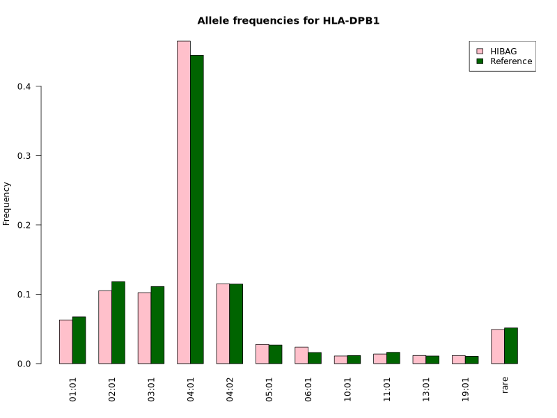
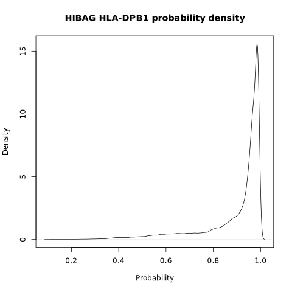
### HLA-DQA1
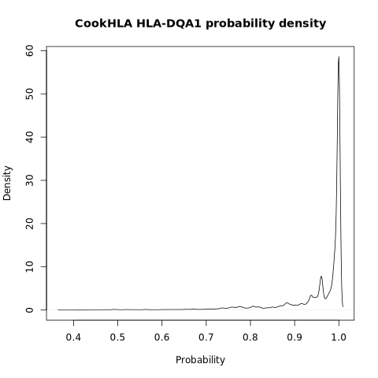
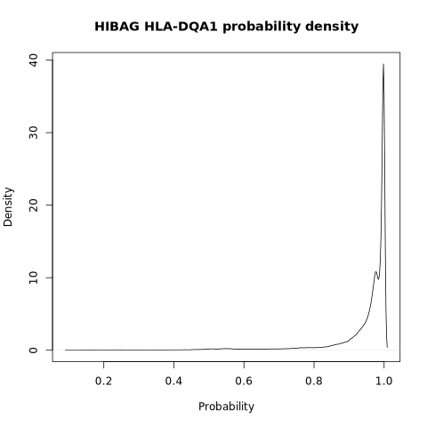
