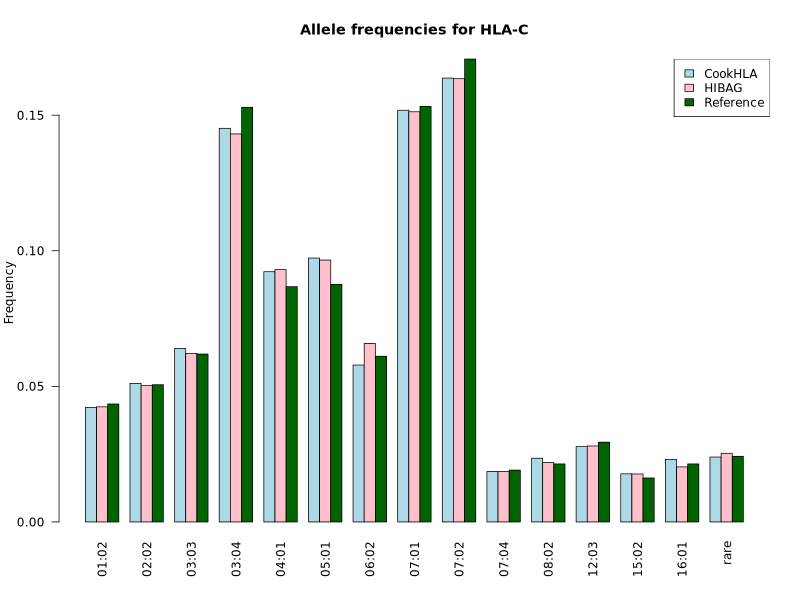
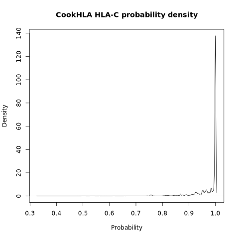

# HLA imputation report 2025.09.16
## Mendelian errors (trios only)
| HLA | Software | Trios | Errors | Error rate |
| --- | --- | --- | --- | --- |
| A | HIBAG | 54437 | 98 | 0.0018 |
| A | CookHLA | 54437 | 1083 | 0.01989 |
| B | HIBAG | 54437 | 427 | 0.00784 |
| B | CookHLA | 54437 | 1563 | 0.02871 |
| C | HIBAG | 54437 | 310 | 0.00569 |
| C | CookHLA | 54437 | 450 | 0.00827 |
| DPB1 | HIBAG | 54437 | 464 | 0.00852 |
| DQA1 | HIBAG | 54437 | 298 | 0.00547 |
| DQA1 | CookHLA | 54437 | 1588 | 0.02917 |
| DQB1 | HIBAG | 54437 | 256 | 0.0047 |
| DQB1 | CookHLA | 54437 | 2759 | 0.05068 |
| DRB1 | HIBAG | 54437 | 1207 | 0.02217 |
| DRB1 | CookHLA | 54437 | 3302 | 0.06066 |
## HIBAG/CookHLA consistency check
### Number of samples with 0, 1 and 2 inconsistencies between HIBAG and CookHLA
| HLA | 0 | 1 | 2 |
| --- | --- | --- | --- |
| A | 208116 | 20255 | 606 |
| B | 204725 | 23000 | 1252 |
| C | 217475 | 11199 | 303 |
| DQA1 | 141718 | 76662 | 10597 |
| DQB1 | 171901 | 53253 | 3823 |
| DRB1 | 170391 | 54354 | 4232 |

Tables with aggregated inconsistency counts per allele are found in the folder called inconsistencies_aggregated
## Allele frequencies and probability density plots
### HLA-A

### HLA-B

### HLA-C

### HLA-DQB1

### HLA-DRB1

### HLA-DPB1

### HLA-DQA1

