# HLA imputation report 2026.02.24
## Mendelian errors (trios only)
| HLA | Software | Trios | Errors | Error rate |
| --- | --- | --- | --- | --- |
| A | HIBAG | 54437 | 91 | 0.00167 |
| A | CookHLA | 54437 | 1004 | 0.01844 |
| B | HIBAG | 54437 | 400 | 0.00735 |
| B | CookHLA | 54437 | 1621 | 0.02978 |
| C | HIBAG | 54437 | 201 | 0.00369 |
| C | CookHLA | 54437 | 414 | 0.00761 |
| DPB1 | HIBAG | 54437 | 446 | 0.00819 |
| DQA1 | HIBAG | 54437 | 269 | 0.00494 |
| DQA1 | CookHLA | 54437 | 1666 | 0.0306 |
| DQB1 | HIBAG | 54437 | 246 | 0.00452 |
| DQB1 | CookHLA | 54437 | 3023 | 0.05553 |
| DRB1 | HIBAG | 54437 | 1183 | 0.02173 |
| DRB1 | CookHLA | 54437 | 3841 | 0.07056 |
## HIBAG/CookHLA consistency check
### Number of samples with 0, 1 and 2 inconsistent alleles between HIBAG and CookHLA
| HLA | 0 | 1 | 2 |
| --- | --- | --- | --- |
| A | 208328 | 20042 | 607 |
| B | 204329 | 23421 | 1227 |
| C | 218235 | 10462 | 280 |
| DQA1 | 140029 | 77903 | 11045 |
| DQB1 | 171315 | 53713 | 3949 |
| DRB1 | 166019 | 57978 | 4980 |
### Aggregated single inconsistency counts per allele (rows = HIBAG, columns = CookHLA)
### HLA-A
|   | 01:01 | 02:01 | 02:05 | 02:06 | 03:01 | 11:01 | 23:01 | 24:02 | 24:03 | 25:01 | 26:01 | 29:02 | 30:01 | 30:02 | 31:01 | 32:01 | 68:01 |
|---|------|------|------|------|------|------|------|------|------|------|------|------|------|------|------|------|---------|
| 01:01 | 0 | 55 | 2 | 0 | 16 | 22 | 1 | 26 | 0 | 4 | 0 | 4 | 3 | 0 | 10 | 5 | 5 |
| 01:02 | 6 | 0 | 0 | 0 | 0 | 0 | 0 | 0 | 0 | 0 | 0 | 0 | 0 | 0 | 0 | 0 | 0 |
| 02:01 | 164 | 0 | 6 | 1042 | 148 | 127 | 62 | 59 | 5 | 27 | 5 | 19 | 6 | 7 | 173 | 26 | 53 |
| 02:02 | 1 | 3 | 60 | 0 | 2 | 0 | 1 | 1 | 0 | 1 | 0 | 1 | 0 | 1 | 1 | 2 | 0 |
| 02:05 | 0 | 9 | 0 | 0 | 0 | 0 | 0 | 0 | 0 | 0 | 0 | 0 | 0 | 0 | 0 | 0 | 3 |
| 02:06 | 0 | 17 | 0 | 0 | 0 | 0 | 0 | 0 | 0 | 0 | 0 | 0 | 0 | 0 | 0 | 0 | 0 |
| 03:01 | 28 | 52 | 4 | 0 | 0 | 85 | 3 | 5 | 0 | 0 | 0 | 2 | 0 | 2 | 46 | 3 | 0 |
| 11:01 | 27 | 95 | 0 | 0 | 40 | 0 | 6 | 39 | 0 | 1 | 1 | 3 | 0 | 0 | 4 | 3 | 1 |
| 23:01 | 17 | 8 | 0 | 0 | 1 | 0 | 0 | 46 | 20 | 0 | 0 | 0 | 0 | 0 | 1 | 0 | 0 |
| 24:02 | 83 | 293 | 2 | 0 | 908 | 49 | 422 | 0 | 3346 | 8 | 2 | 7 | 3 | 3 | 30 | 26 | 10 |
| 25:01 | 0 | 2 | 0 | 0 | 0 | 1 | 0 | 0 | 0 | 0 | 561 | 0 | 0 | 0 | 0 | 0 | 0 |
| 26:01 | 34 | 74 | 2 | 0 | 43 | 14 | 4 | 13 | 4 | 3897 | 0 | 2 | 2 | 0 | 5 | 9 | 9 |
| 29:01 | 0 | 0 | 0 | 0 | 0 | 0 | 0 | 0 | 0 | 0 | 0 | 576 | 0 | 0 | 0 | 0 | 0 |
| 29:02 | 0 | 0 | 0 | 0 | 4 | 0 | 0 | 0 | 0 | 0 | 0 | 0 | 0 | 0 | 0 | 9 | 0 |
| 29:10 | 0 | 0 | 0 | 0 | 0 | 0 | 0 | 0 | 0 | 0 | 0 | 2 | 0 | 0 | 0 | 0 | 0 |
| 30:01 | 2 | 8 | 0 | 0 | 2 | 1 | 0 | 0 | 0 | 0 | 0 | 0 | 0 | 0 | 0 | 1 | 5 |
| 30:02 | 8 | 35 | 0 | 0 | 11 | 4 | 1 | 10 | 0 | 2 | 1 | 1 | 1 | 0 | 2 | 1 | 0 |
| 30:04 | 29 | 45 | 1 | 1 | 25 | 9 | 7 | 8 | 0 | 28 | 0 | 5 | 3 | 460 | 13 | 5 | 5 |
| 31:01 | 5 | 11 | 0 | 0 | 2 | 0 | 0 | 3 | 0 | 0 | 0 | 0 | 0 | 0 | 0 | 0 | 3 |
| 32:01 | 14 | 33 | 0 | 0 | 3 | 6 | 7 | 9 | 0 | 0 | 0 | 3 | 0 | 1 | 3 | 0 | 5 |
| 33:01 | 0 | 0 | 0 | 0 | 0 | 0 | 0 | 1 | 0 | 0 | 0 | 0 | 0 | 0 | 1174 | 0 | 0 |
| 33:03 | 24 | 55 | 0 | 1 | 3 | 1 | 1 | 4 | 0 | 0 | 0 | 0 | 0 | 0 | 967 | 1 | 2 |
| 34:02 | 38 | 71 | 1 | 0 | 68 | 24 | 1 | 17 | 1 | 1 | 1 | 7 | 1 | 1 | 20 | 8 | 6 |
| 36:01 | 1 | 2 | 0 | 0 | 0 | 0 | 0 | 1 | 0 | 0 | 0 | 0 | 0 | 0 | 21 | 0 | 0 |
| 66:01 | 1 | 0 | 0 | 0 | 0 | 0 | 0 | 1 | 0 | 417 | 747 | 0 | 0 | 0 | 1 | 0 | 0 |
| 66:02 | 0 | 0 | 0 | 0 | 0 | 0 | 0 | 0 | 0 | 0 | 0 | 0 | 0 | 0 | 0 | 0 | 1 |
| 68:01 | 7 | 404 | 1 | 3 | 13 | 14 | 5 | 4 | 0 | 0 | 2 | 4 | 2 | 0 | 6 | 8 | 0 |
| 68:02 | 0 | 1 | 0 | 0 | 1 | 0 | 0 | 0 | 0 | 0 | 0 | 0 | 2 | 0 | 0 | 0 | 1107 |
| 69:01 | 2 | 129 | 0 | 0 | 1 | 0 | 0 | 1 | 0 | 0 | 0 | 0 | 3 | 0 | 0 | 0 | 460 |
| 74:01 | 0 | 3 | 0 | 0 | 0 | 0 | 0 | 0 | 0 | 0 | 0 | 0 | 0 | 0 | 0 | 57 | 6 |
| 74:03 | 0 | 0 | 0 | 0 | 0 | 0 | 0 | 0 | 0 | 0 | 0 | 0 | 0 | 0 | 0 | 51 | 0 |
| 80:01 | 0 | 3 | 4 | 0 | 0 | 0 | 1 | 0 | 0 | 1 | 0 | 0 | 1 | 1 | 0 | 0 | 0 |
### HLA-B
|   | 07:02 | 08:01 | 13:02 | 14:01 | 14:02 | 15:01 | 15:10 | 18:01 | 27:05 | 35:01 | 35:03 | 37:01 | 38:01 | 39:06 | 40:01 | 40:02 | 41:01 | 44:02 | 44:03 | 44:04 | 44:05 | 49:01 | 50:01 | 51:01 | 52:01 | 55:01 | 56:01 | 57:01 | 58:01 |
|---|------|------|------|------|------|------|------|------|------|------|------|------|------|------|------|------|------|------|------|------|------|------|------|------|------|------|------|------|---------|
| 07:02 | 0 | 8 | 6 | 2 | 0 | 3 | 0 | 3 | 4 | 4 | 0 | 1 | 1 | 12 | 11 | 5 | 1 | 1 | 3 | 0 | 83 | 2 | 0 | 9 | 0 | 4 | 1 | 1 | 0 |
| 07:05 | 320 | 1 | 0 | 0 | 0 | 0 | 0 | 0 | 2 | 0 | 0 | 0 | 0 | 1 | 0 | 0 | 1 | 0 | 0 | 0 | 0 | 3 | 0 | 0 | 0 | 1 | 0 | 0 | 0 |
| 08:01 | 80 | 0 | 0 | 0 | 0 | 18 | 0 | 96 | 0 | 2 | 0 | 0 | 0 | 0 | 4 | 1 | 0 | 14 | 5 | 0 | 0 | 0 | 0 | 1 | 7 | 4 | 0 | 28 | 5 |
| 13:02 | 35 | 4 | 0 | 6 | 0 | 2 | 0 | 0 | 0 | 0 | 0 | 2 | 0 | 0 | 0 | 0 | 2 | 0 | 0 | 0 | 0 | 1 | 1 | 0 | 0 | 0 | 0 | 0 | 0 |
| 14:01 | 0 | 1 | 1 | 0 | 51 | 0 | 0 | 0 | 1 | 0 | 0 | 0 | 0 | 0 | 0 | 0 | 0 | 0 | 0 | 0 | 1 | 0 | 0 | 0 | 0 | 0 | 0 | 1 | 0 |
| 14:02 | 1 | 3 | 0 | 1 | 0 | 0 | 0 | 0 | 0 | 2 | 0 | 0 | 2 | 0 | 0 | 1 | 0 | 0 | 1 | 0 | 0 | 0 | 0 | 0 | 0 | 0 | 0 | 1 | 0 |
| 15:01 | 12 | 22 | 0 | 2 | 7 | 0 | 1 | 25 | 7 | 211 | 0 | 4 | 3 | 12 | 47 | 3 | 10 | 147 | 6 | 0 | 1 | 1 | 3 | 9 | 6 | 0 | 1 | 3 | 2 |
| 15:02 | 0 | 0 | 0 | 0 | 0 | 137 | 0 | 0 | 0 | 0 | 0 | 0 | 0 | 0 | 0 | 0 | 0 | 1 | 0 | 0 | 0 | 0 | 0 | 1 | 0 | 0 | 0 | 0 | 0 |
| 15:03 | 27 | 24 | 2 | 1 | 0 | 14 | 0 | 3 | 8 | 8 | 0 | 1 | 0 | 1 | 13 | 3 | 3 | 12 | 7 | 0 | 107 | 2 | 1 | 5 | 1 | 1 | 0 | 3 | 1 |
| 15:08 | 0 | 0 | 0 | 0 | 0 | 5 | 0 | 0 | 0 | 0 | 0 | 0 | 0 | 0 | 0 | 0 | 0 | 0 | 0 | 0 | 0 | 0 | 0 | 0 | 0 | 0 | 0 | 0 | 0 |
| 15:10 | 0 | 0 | 0 | 0 | 0 | 45 | 0 | 0 | 0 | 0 | 0 | 0 | 0 | 0 | 0 | 0 | 0 | 0 | 1 | 0 | 0 | 0 | 0 | 0 | 0 | 0 | 0 | 0 | 0 |
| 15:16 | 35 | 20 | 1 | 1 | 2 | 13 | 0 | 1 | 7 | 3 | 1 | 5 | 1 | 0 | 14 | 3 | 0 | 7 | 4 | 0 | 1 | 2 | 0 | 3 | 0 | 0 | 0 | 3 | 0 |
| 15:17 | 18 | 24 | 1 | 1 | 5 | 101 | 6 | 5 | 7 | 13 | 0 | 3 | 4 | 0 | 10 | 3 | 29 | 13 | 6 | 0 | 0 | 3 | 1 | 3 | 2 | 6 | 0 | 7 | 0 |
| 15:18 | 37 | 15 | 5 | 0 | 3 | 91 | 0 | 8 | 18 | 4 | 0 | 5 | 4 | 1 | 26 | 3 | 2 | 155 | 14 | 0 | 1 | 0 | 1 | 131 | 0 | 2 | 2 | 12 | 2 |
| 18:01 | 59 | 16 | 0 | 0 | 3 | 16 | 0 | 0 | 8 | 8 | 1 | 1 | 81 | 0 | 12 | 5 | 1 | 4 | 8 | 0 | 0 | 1 | 2 | 3 | 734 | 8 | 2 | 0 | 0 |
| 18:02 | 0 | 0 | 0 | 0 | 0 | 0 | 0 | 20 | 0 | 0 | 0 | 0 | 0 | 0 | 0 | 0 | 0 | 0 | 0 | 0 | 0 | 0 | 0 | 0 | 0 | 0 | 0 | 0 | 0 |
| 18:03 | 0 | 1 | 0 | 0 | 0 | 0 | 0 | 4 | 0 | 6 | 0 | 0 | 0 | 0 | 5 | 0 | 0 | 3 | 2 | 0 | 0 | 0 | 0 | 0 | 3 | 0 | 0 | 0 | 0 |
| 18:18 | 0 | 0 | 0 | 0 | 0 | 0 | 0 | 44 | 0 | 0 | 0 | 0 | 0 | 0 | 0 | 0 | 0 | 0 | 0 | 0 | 0 | 0 | 0 | 0 | 0 | 0 | 0 | 0 | 0 |
| 27:02 | 0 | 0 | 0 | 0 | 2 | 0 | 0 | 0 | 669 | 23 | 0 | 0 | 5 | 4 | 0 | 3 | 0 | 3 | 0 | 0 | 0 | 0 | 0 | 0 | 0 | 3 | 2 | 14 | 2 |
| 27:03 | 0 | 1 | 0 | 0 | 0 | 0 | 0 | 1 | 0 | 0 | 0 | 0 | 0 | 0 | 0 | 0 | 0 | 0 | 0 | 0 | 0 | 0 | 0 | 0 | 1 | 0 | 0 | 0 | 0 |
| 27:05 | 27 | 20 | 2 | 2 | 3 | 23 | 0 | 8 | 0 | 16 | 0 | 1 | 3 | 2 | 18 | 8 | 0 | 16 | 6 | 1 | 1 | 1 | 0 | 19 | 3 | 5 | 0 | 9 | 1 |
| 35:01 | 8 | 9 | 2 | 0 | 0 | 1283 | 0 | 6 | 5 | 0 | 8 | 2 | 7 | 9 | 35 | 2 | 2 | 13 | 11 | 0 | 0 | 1 | 1 | 6 | 1 | 0 | 2 | 8 | 5 |
| 35:02 | 10 | 13 | 0 | 1 | 0 | 15 | 0 | 0 | 5 | 681 | 1 | 1 | 0 | 0 | 5 | 0 | 9 | 6 | 6 | 0 | 0 | 1 | 2 | 3 | 0 | 0 | 0 | 3 | 1 |
| 35:03 | 144 | 135 | 14 | 11 | 17 | 190 | 0 | 44 | 59 | 773 | 0 | 17 | 20 | 13 | 95 | 9 | 2 | 127 | 52 | 0 | 1 | 9 | 2 | 59 | 3 | 16 | 5 | 33 | 2 |
| 35:08 | 0 | 2 | 1 | 0 | 0 | 0 | 0 | 0 | 0 | 929 | 0 | 0 | 1 | 0 | 2 | 0 | 2 | 4 | 0 | 0 | 0 | 0 | 0 | 1 | 0 | 0 | 0 | 1 | 0 |
| 37:01 | 4 | 0 | 11 | 0 | 0 | 0 | 0 | 1 | 3 | 3 | 0 | 0 | 0 | 0 | 0 | 13 | 0 | 0 | 0 | 0 | 0 | 0 | 0 | 3 | 0 | 0 | 0 | 0 | 0 |
| 38:01 | 0 | 1 | 2 | 0 | 1 | 3 | 0 | 3 | 2 | 9 | 1 | 3 | 0 | 7 | 0 | 0 | 1 | 6 | 1 | 0 | 0 | 0 | 0 | 2 | 0 | 0 | 0 | 2 | 1 |
| 39:01 | 51 | 30 | 7 | 3 | 2 | 37 | 0 | 30 | 19 | 24 | 0 | 2 | 1185 | 1417 | 37 | 4 | 0 | 40 | 14 | 0 | 1 | 4 | 2 | 16 | 2 | 10 | 3 | 12 | 1 |
| 39:06 | 0 | 1 | 0 | 0 | 0 | 0 | 0 | 0 | 1 | 0 | 0 | 0 | 0 | 0 | 2 | 0 | 0 | 0 | 0 | 0 | 0 | 0 | 0 | 0 | 0 | 0 | 0 | 0 | 0 |
| 39:24 | 13 | 7 | 0 | 2 | 2 | 5 | 0 | 0 | 3 | 4 | 0 | 0 | 0 | 1 | 5 | 3 | 0 | 4 | 2 | 0 | 0 | 1 | 0 | 4 | 0 | 1 | 0 | 0 | 0 |
| 40:01 | 2 | 2 | 1 | 0 | 0 | 55 | 0 | 5 | 0 | 11 | 0 | 0 | 0 | 0 | 0 | 1 | 0 | 21 | 3 | 0 | 0 | 0 | 0 | 7 | 1 | 0 | 0 | 0 | 0 |
| 40:02 | 7 | 6 | 0 | 0 | 0 | 4 | 0 | 2 | 23 | 2 | 0 | 23 | 0 | 5 | 3 | 0 | 0 | 5 | 0 | 1 | 0 | 0 | 0 | 6 | 0 | 0 | 1 | 2 | 1 |
| 40:06 | 0 | 0 | 0 | 0 | 0 | 0 | 0 | 0 | 1 | 0 | 0 | 0 | 0 | 0 | 0 | 158 | 0 | 0 | 0 | 0 | 0 | 0 | 0 | 0 | 0 | 0 | 0 | 0 | 0 |
| 40:10 | 0 | 0 | 0 | 0 | 1 | 0 | 0 | 0 | 0 | 0 | 0 | 0 | 0 | 0 | 0 | 0 | 0 | 0 | 0 | 0 | 0 | 0 | 0 | 0 | 0 | 0 | 0 | 0 | 0 |
| 41:01 | 0 | 0 | 0 | 0 | 0 | 0 | 0 | 0 | 0 | 1 | 0 | 0 | 0 | 0 | 0 | 0 | 0 | 0 | 0 | 1 | 1 | 0 | 0 | 0 | 0 | 0 | 0 | 1 | 0 |
| 41:02 | 0 | 0 | 0 | 0 | 0 | 0 | 0 | 0 | 0 | 0 | 0 | 0 | 0 | 0 | 0 | 0 | 897 | 1 | 0 | 0 | 0 | 0 | 0 | 0 | 0 | 0 | 0 | 0 | 0 |
| 42:01 | 1 | 0 | 0 | 0 | 0 | 0 | 0 | 0 | 0 | 0 | 0 | 0 | 0 | 0 | 0 | 0 | 31 | 0 | 0 | 0 | 0 | 0 | 0 | 0 | 0 | 0 | 0 | 0 | 0 |
| 42:02 | 0 | 0 | 0 | 0 | 0 | 0 | 0 | 0 | 0 | 0 | 0 | 0 | 0 | 0 | 0 | 0 | 29 | 0 | 0 | 0 | 0 | 0 | 0 | 0 | 0 | 0 | 0 | 0 | 0 |
| 44:02 | 43 | 72 | 0 | 1 | 2 | 75 | 0 | 10 | 11 | 24 | 1 | 2 | 2 | 2 | 113 | 5 | 1 | 0 | 5 | 0 | 16 | 2 | 2 | 12 | 0 | 0 | 0 | 22 | 1 |
| 44:03 | 43 | 44 | 11 | 5 | 7 | 50 | 0 | 19 | 28 | 40 | 2 | 10 | 3 | 1 | 39 | 15 | 1 | 31 | 0 | 117 | 1 | 24 | 5 | 23 | 14 | 11 | 8 | 16 | 9 |
| 44:05 | 0 | 0 | 0 | 0 | 0 | 0 | 0 | 0 | 0 | 1 | 0 | 0 | 0 | 0 | 0 | 1 | 0 | 28 | 1 | 0 | 0 | 0 | 0 | 1 | 0 | 0 | 0 | 0 | 0 |
| 45:01 | 2 | 0 | 1 | 0 | 1 | 7 | 0 | 3 | 2 | 2 | 0 | 0 | 0 | 1 | 3 | 0 | 0 | 13 | 291 | 38 | 0 | 2 | 1566 | 1 | 0 | 1 | 0 | 6 | 0 |
| 46:01 | 0 | 0 | 0 | 0 | 0 | 105 | 0 | 0 | 0 | 0 | 0 | 0 | 0 | 0 | 0 | 0 | 0 | 0 | 0 | 0 | 0 | 0 | 0 | 0 | 0 | 0 | 0 | 0 | 0 |
| 47:01 | 134 | 223 | 17 | 15 | 21 | 144 | 0 | 32 | 72 | 61 | 4 | 15 | 6 | 5 | 111 | 23 | 2 | 124 | 33 | 1 | 2 | 20 | 10 | 43 | 80 | 11 | 4 | 85 | 1 |
| 48:01 | 152 | 27 | 18 | 43 | 334 | 24 | 0 | 33 | 16 | 3 | 4 | 27 | 4 | 7 | 34 | 17 | 1 | 65 | 16 | 0 | 0 | 5 | 3 | 16 | 3 | 10 | 3 | 9 | 0 |
| 49:01 | 2 | 1 | 2 | 0 | 0 | 0 | 0 | 0 | 0 | 1 | 0 | 1 | 1 | 0 | 0 | 0 | 1 | 0 | 4 | 0 | 0 | 0 | 0 | 3 | 1 | 0 | 2 | 0 | 1 |
| 50:01 | 14 | 22 | 0 | 1 | 0 | 23 | 0 | 4 | 5 | 6 | 0 | 0 | 0 | 1 | 10 | 2 | 1 | 10 | 35 | 0 | 0 | 5 | 0 | 8 | 0 | 1 | 0 | 3 | 0 |
| 51:01 | 33 | 25 | 1 | 1 | 3 | 337 | 0 | 8 | 4 | 11 | 44 | 1 | 1 | 3 | 57 | 6 | 235 | 78 | 645 | 0 | 0 | 6 | 0 | 0 | 29 | 5 | 2 | 19 | 0 |
| 51:05 | 0 | 0 | 0 | 0 | 0 | 0 | 0 | 0 | 0 | 1 | 0 | 0 | 0 | 0 | 0 | 0 | 0 | 0 | 0 | 0 | 0 | 0 | 0 | 0 | 0 | 0 | 0 | 0 | 0 |
| 51:07 | 0 | 0 | 0 | 0 | 0 | 0 | 0 | 0 | 0 | 0 | 0 | 0 | 0 | 0 | 0 | 0 | 0 | 0 | 0 | 0 | 0 | 0 | 0 | 17 | 0 | 0 | 0 | 0 | 0 |
| 51:08 | 0 | 0 | 0 | 0 | 0 | 0 | 0 | 0 | 0 | 0 | 0 | 0 | 0 | 0 | 0 | 0 | 0 | 0 | 46 | 0 | 0 | 0 | 0 | 3 | 0 | 0 | 0 | 0 | 0 |
| 52:01 | 0 | 0 | 0 | 0 | 0 | 0 | 0 | 0 | 0 | 0 | 0 | 0 | 0 | 0 | 0 | 0 | 0 | 0 | 1 | 0 | 0 | 0 | 0 | 32 | 0 | 0 | 0 | 0 | 0 |
| 53:01 | 0 | 0 | 0 | 0 | 0 | 0 | 0 | 0 | 0 | 618 | 0 | 0 | 0 | 0 | 0 | 0 | 0 | 0 | 3 | 0 | 0 | 0 | 0 | 0 | 0 | 0 | 0 | 0 | 2 |
| 54:01 | 0 | 0 | 0 | 0 | 0 | 0 | 0 | 0 | 0 | 0 | 0 | 0 | 0 | 0 | 0 | 0 | 0 | 0 | 0 | 0 | 0 | 0 | 0 | 0 | 0 | 4 | 79 | 0 | 0 |
| 55:01 | 2 | 2 | 1 | 0 | 0 | 0 | 0 | 1 | 0 | 2 | 0 | 0 | 0 | 0 | 1 | 1 | 0 | 1 | 0 | 0 | 0 | 0 | 0 | 0 | 1 | 0 | 144 | 2 | 0 |
| 55:02 | 0 | 0 | 0 | 0 | 0 | 0 | 0 | 0 | 0 | 0 | 0 | 0 | 0 | 0 | 0 | 0 | 0 | 0 | 0 | 0 | 0 | 0 | 0 | 0 | 0 | 0 | 1 | 0 | 0 |
| 56:01 | 0 | 0 | 0 | 0 | 0 | 0 | 0 | 0 | 0 | 2 | 0 | 0 | 4 | 2 | 5 | 0 | 0 | 1 | 0 | 0 | 0 | 0 | 0 | 0 | 0 | 374 | 0 | 0 | 0 |
| 57:01 | 4 | 3 | 0 | 0 | 0 | 7 | 0 | 0 | 0 | 5 | 0 | 0 | 0 | 2 | 5 | 0 | 0 | 7 | 1 | 0 | 0 | 3 | 0 | 4 | 0 | 0 | 0 | 0 | 1 |
| 57:03 | 0 | 0 | 0 | 0 | 0 | 0 | 0 | 0 | 0 | 0 | 0 | 0 | 0 | 0 | 0 | 0 | 0 | 0 | 0 | 0 | 0 | 0 | 0 | 0 | 0 | 0 | 0 | 14 | 0 |
| 58:01 | 0 | 1 | 0 | 1 | 0 | 4 | 0 | 0 | 2 | 735 | 0 | 0 | 1 | 0 | 0 | 0 | 1 | 5 | 1 | 0 | 0 | 0 | 0 | 1 | 1 | 0 | 0 | 3 | 0 |
| 73:01 | 14 | 10 | 1 | 1 | 15 | 3 | 0 | 0 | 5 | 3 | 0 | 1 | 1 | 2 | 3 | 0 | 0 | 9 | 3 | 0 | 0 | 0 | 1 | 3 | 1 | 0 | 1 | 1 | 0 |
| 81:01 | 6 | 0 | 0 | 0 | 0 | 0 | 0 | 0 | 0 | 0 | 0 | 0 | 0 | 0 | 0 | 0 | 0 | 0 | 0 | 0 | 0 | 0 | 0 | 0 | 0 | 0 | 0 | 0 | 0 |
### HLA-C
|   | 01:02 | 02:02 | 03:03 | 03:04 | 04:01 | 05:01 | 06:02 | 06:06 | 07:01 | 07:02 | 07:04 | 08:02 | 12:02 | 12:03 | 14:02 | 15:02 | 16:01 | 17:01 |
|---|------|------|------|------|------|------|------|------|------|------|------|------|------|------|------|------|------|---------|
| 01:02 | 0 | 17 | 15 | 26 | 21 | 12 | 7 | 0 | 36 | 27 | 5 | 3 | 1 | 8 | 1 | 63 | 3 | 0 |
| 02:02 | 14 | 0 | 2 | 6 | 8 | 2 | 1 | 0 | 13 | 8 | 1 | 4 | 1 | 0 | 0 | 1 | 5 | 0 |
| 02:10 | 0 | 137 | 0 | 0 | 0 | 0 | 0 | 0 | 0 | 0 | 0 | 0 | 0 | 0 | 0 | 0 | 0 | 0 |
| 03:02 | 1 | 0 | 672 | 149 | 1 | 0 | 0 | 0 | 0 | 0 | 0 | 0 | 2 | 0 | 0 | 0 | 0 | 0 |
| 03:03 | 3 | 5 | 0 | 183 | 9 | 15 | 8 | 0 | 18 | 15 | 2 | 2 | 1 | 1 | 0 | 4 | 3 | 0 |
| 03:04 | 12 | 9 | 259 | 0 | 31 | 21 | 20 | 0 | 38 | 30 | 5 | 5 | 1 | 8 | 2 | 11 | 2 | 2 |
| 03:05 | 0 | 0 | 1 | 13 | 0 | 0 | 0 | 0 | 0 | 0 | 0 | 0 | 0 | 0 | 0 | 0 | 0 | 0 |
| 03:10 | 0 | 0 | 20 | 42 | 0 | 0 | 0 | 0 | 0 | 0 | 0 | 0 | 0 | 0 | 0 | 0 | 0 | 0 |
| 04:01 | 0 | 51 | 5 | 9 | 0 | 97 | 6 | 0 | 49 | 13 | 3 | 4 | 44 | 1 | 0 | 3 | 47 | 238 |
| 04:03 | 0 | 0 | 0 | 0 | 4 | 0 | 0 | 0 | 9 | 0 | 0 | 0 | 0 | 0 | 0 | 0 | 0 | 0 |
| 05:01 | 0 | 2 | 0 | 2 | 1 | 0 | 1 | 0 | 8 | 1 | 1 | 7 | 0 | 0 | 0 | 1 | 0 | 1 |
| 06:02 | 3 | 1 | 0 | 2 | 15 | 4 | 0 | 3483 | 62 | 2 | 0 | 5 | 1 | 9 | 0 | 1 | 0 | 0 |
| 07:01 | 3 | 8 | 2 | 1 | 1 | 0 | 0 | 0 | 0 | 24 | 1 | 1 | 1 | 0 | 1 | 0 | 0 | 4 |
| 07:02 | 0 | 0 | 0 | 3 | 14 | 0 | 2 | 0 | 22 | 0 | 0 | 1 | 0 | 0 | 0 | 0 | 0 | 0 |
| 07:04 | 0 | 17 | 1 | 4 | 5 | 2 | 3 | 0 | 6 | 22 | 0 | 0 | 1 | 0 | 1 | 5 | 0 | 0 |
| 08:01 | 0 | 0 | 0 | 0 | 0 | 241 | 0 | 0 | 1 | 0 | 0 | 294 | 0 | 0 | 0 | 0 | 0 | 0 |
| 08:02 | 0 | 0 | 0 | 0 | 0 | 113 | 1 | 0 | 5 | 0 | 0 | 0 | 0 | 0 | 0 | 1 | 0 | 0 |
| 08:03 | 0 | 0 | 0 | 0 | 0 | 35 | 0 | 0 | 0 | 0 | 0 | 287 | 0 | 0 | 0 | 0 | 0 | 0 |
| 12:03 | 0 | 1 | 0 | 5 | 23 | 5 | 33 | 0 | 5 | 6 | 0 | 0 | 0 | 0 | 0 | 52 | 1 | 0 |
| 14:02 | 7 | 18 | 16 | 39 | 18 | 26 | 50 | 1 | 43 | 46 | 7 | 7 | 11 | 5 | 0 | 4 | 7 | 0 |
| 14:03 | 0 | 0 | 0 | 0 | 0 | 0 | 0 | 0 | 0 | 0 | 0 | 0 | 0 | 0 | 108 | 0 | 0 | 0 |
| 15:02 | 2 | 10 | 678 | 87 | 3 | 1 | 1 | 0 | 1 | 2 | 0 | 2 | 2 | 2 | 1 | 0 | 272 | 1 |
| 15:04 | 0 | 0 | 0 | 0 | 0 | 0 | 0 | 0 | 0 | 0 | 0 | 0 | 0 | 0 | 0 | 80 | 0 | 0 |
| 15:05 | 0 | 0 | 3 | 1 | 2 | 1 | 1 | 0 | 1 | 1 | 0 | 0 | 0 | 0 | 0 | 395 | 1 | 0 |
| 15:11 | 0 | 146 | 0 | 0 | 0 | 0 | 0 | 0 | 0 | 0 | 0 | 0 | 0 | 0 | 0 | 0 | 0 | 0 |
| 16:01 | 0 | 0 | 2 | 12 | 4 | 2 | 0 | 0 | 0 | 0 | 1 | 0 | 0 | 1 | 0 | 0 | 0 | 6 |
| 16:02 | 0 | 0 | 1 | 0 | 0 | 0 | 0 | 0 | 0 | 0 | 0 | 0 | 1 | 0 | 1 | 0 | 563 | 0 |
| 16:04 | 0 | 0 | 0 | 0 | 0 | 0 | 0 | 0 | 0 | 0 | 0 | 0 | 0 | 0 | 0 | 0 | 199 | 0 |
| 17:01 | 0 | 0 | 0 | 0 | 1 | 0 | 5 | 0 | 0 | 0 | 0 | 0 | 0 | 0 | 0 | 0 | 0 | 0 |
| 18:01 | 0 | 0 | 0 | 0 | 9 | 8 | 0 | 0 | 0 | 1 | 0 | 0 | 0 | 0 | 0 | 0 | 0 | 0 |
### HLA-DQA1
|   | 01:01 | 01:02 | 01:03 | 02:01 | 03:01 | 04:01 | 05:01 |
|---|------|------|------|------|------|------|---------|
| 01:01 | 0 | 74 | 11 | 5 | 2 | 2 | 8 |
| 01:02 | 171 | 0 | 1692 | 298 | 85 | 15 | 832 |
| 01:03 | 158 | 2679 | 0 | 203 | 139 | 44 | 894 |
| 01:04 | 7192 | 273 | 41 | 4 | 15 | 3 | 35 |
| 01:05 | 3284 | 63 | 6 | 0 | 1 | 0 | 3 |
| 02:01 | 15 | 316 | 28 | 0 | 98 | 15 | 70 |
| 03:01 | 7 | 19 | 6 | 8 | 0 | 279 | 115 |
| 03:02 | 205 | 1029 | 457 | 968 | 503 | 428 | 1243 |
| 03:03 | 31 | 67 | 21 | 48 | 23784 | 393 | 213 |
| 04:01 | 2 | 12 | 1 | 6 | 32 | 0 | 1 |
| 05:01 | 97 | 1586 | 537 | 152 | 204 | 48 | 0 |
| 05:03 | 0 | 0 | 0 | 0 | 0 | 0 | 27 |
| 05:05 | 151 | 246 | 75 | 350 | 839 | 21 | 23873 |
| 05:09 | 0 | 0 | 0 | 0 | 58 | 0 | 0 |
| 06:01 | 12 | 40 | 9 | 183 | 244 | 92 | 407 |
### HLA-DQB1
|   | 02:01 | 02:02 | 03:01 | 03:02 | 03:03 | 03:05 | 04:02 | 05:01 | 05:02 | 05:03 | 06:01 | 06:02 | 06:03 | 06:04 | 06:09 |
|---|------|------|------|------|------|------|------|------|------|------|------|------|------|------|---------|
| 02:01 | 0 | 139 | 1345 | 467 | 375 | 0 | 290 | 803 | 11 | 152 | 2 | 1550 | 640 | 108 | 1 |
| 02:02 | 1817 | 0 | 406 | 163 | 52 | 0 | 163 | 478 | 1 | 31 | 1 | 1478 | 396 | 46 | 0 |
| 03:01 | 619 | 226 | 0 | 2360 | 704 | 3 | 271 | 715 | 100 | 1732 | 23 | 1932 | 474 | 217 | 0 |
| 03:02 | 1441 | 163 | 211 | 0 | 37 | 10 | 356 | 250 | 1 | 497 | 4 | 1104 | 538 | 46 | 0 |
| 03:03 | 403 | 109 | 1508 | 384 | 0 | 0 | 482 | 198 | 814 | 96 | 8 | 724 | 620 | 134 | 1 |
| 03:04 | 2 | 0 | 96 | 420 | 0 | 0 | 0 | 1 | 0 | 0 | 0 | 7 | 1 | 3 | 0 |
| 03:19 | 9 | 0 | 1 | 0 | 1 | 0 | 0 | 0 | 0 | 0 | 0 | 11 | 2 | 1 | 0 |
| 04:02 | 171 | 23 | 33 | 136 | 12 | 0 | 0 | 108 | 0 | 28 | 1 | 175 | 123 | 83 | 2 |
| 05:01 | 355 | 159 | 354 | 527 | 173 | 1 | 54 | 0 | 4 | 57 | 12 | 780 | 876 | 68 | 49 |
| 05:02 | 18 | 34 | 316 | 21 | 193 | 0 | 5 | 28 | 0 | 21 | 40 | 53 | 60 | 6 | 1 |
| 05:03 | 101 | 37 | 390 | 1179 | 82 | 0 | 194 | 429 | 5 | 0 | 2 | 483 | 102 | 35 | 0 |
| 05:04 | 4 | 527 | 3 | 0 | 0 | 0 | 1 | 1 | 0 | 4 | 0 | 0 | 2 | 0 | 0 |
| 06:01 | 72 | 66 | 40 | 76 | 18 | 0 | 6 | 20 | 1 | 9 | 0 | 40 | 17 | 6 | 0 |
| 06:02 | 322 | 79 | 522 | 565 | 157 | 0 | 151 | 408 | 12 | 426 | 5 | 0 | 731 | 268 | 0 |
| 06:03 | 738 | 126 | 870 | 507 | 253 | 1 | 526 | 187 | 42 | 213 | 2 | 3059 | 0 | 112 | 0 |
| 06:04 | 271 | 43 | 287 | 63 | 44 | 0 | 46 | 42 | 3 | 53 | 0 | 974 | 997 | 0 | 3 |
| 06:09 | 218 | 5 | 58 | 35 | 16 | 0 | 0 | 13 | 2 | 0 | 0 | 133 | 24 | 4 | 0 |
### HLA-DRB1
|   | 01:01 | 03:01 | 04:01 | 04:02 | 04:03 | 04:04 | 04:05 | 04:07 | 07:01 | 08:01 | 10:01 | 11:01 | 11:03 | 11:04 | 12:01 | 13:01 | 13:02 | 13:03 | 14:01 | 14:04 | 15:01 | 15:02 | 16:01 |
|---|------|------|------|------|------|------|------|------|------|------|------|------|------|------|------|------|------|------|------|------|------|------|---------|
| 01:01 | 0 | 86 | 34 | 1 | 0 | 38 | 1 | 13 | 42 | 33 | 9 | 20 | 0 | 0 | 10 | 46 | 34 | 1 | 13 | 0 | 153 | 1 | 7 |
| 01:02 | 520 | 159 | 72 | 6 | 4 | 55 | 0 | 11 | 447 | 64 | 24 | 20 | 1 | 0 | 26 | 62 | 69 | 9 | 16 | 0 | 181 | 4 | 7 |
| 01:03 | 3088 | 6 | 22 | 1 | 0 | 21 | 0 | 4 | 35 | 22 | 11 | 17 | 1 | 0 | 5 | 27 | 22 | 1 | 5 | 0 | 37 | 0 | 5 |
| 03:01 | 29 | 0 | 39 | 4 | 0 | 38 | 0 | 3 | 73 | 11 | 5 | 17 | 0 | 0 | 12 | 20 | 19 | 0 | 4 | 0 | 78 | 0 | 3 |
| 03:02 | 3 | 1 | 0 | 0 | 0 | 0 | 0 | 0 | 1 | 57 | 0 | 0 | 0 | 0 | 0 | 0 | 0 | 0 | 0 | 0 | 0 | 0 | 0 |
| 04:01 | 417 | 390 | 0 | 65 | 268 | 20466 | 1 | 214 | 490 | 193 | 47 | 41 | 0 | 1 | 100 | 219 | 247 | 12 | 52 | 0 | 612 | 16 | 17 |
| 04:02 | 0 | 1 | 96 | 0 | 0 | 46 | 0 | 0 | 1 | 15 | 0 | 1 | 0 | 0 | 0 | 0 | 1 | 0 | 0 | 0 | 1 | 0 | 0 |
| 04:03 | 12 | 16 | 978 | 4 | 0 | 400 | 0 | 36 | 13 | 13 | 4 | 5 | 2 | 0 | 1 | 9 | 5 | 0 | 4 | 0 | 14 | 2 | 0 |
| 04:04 | 17 | 123 | 264 | 87 | 3 | 0 | 0 | 1 | 25 | 45 | 3 | 6 | 0 | 0 | 7 | 14 | 10 | 1 | 3 | 0 | 21 | 0 | 0 |
| 04:05 | 4 | 16 | 164 | 6 | 1 | 1092 | 0 | 15 | 18 | 5 | 1 | 3 | 1 | 0 | 4 | 4 | 8 | 1 | 2 | 0 | 10 | 1 | 0 |
| 04:06 | 8 | 2 | 9 | 0 | 0 | 5 | 0 | 1 | 24 | 95 | 1 | 0 | 0 | 0 | 5 | 1 | 2 | 0 | 2 | 0 | 10 | 1 | 0 |
| 04:07 | 24 | 32 | 1209 | 1 | 1 | 90 | 0 | 0 | 24 | 13 | 5 | 1 | 0 | 0 | 5 | 14 | 9 | 1 | 6 | 0 | 40 | 0 | 1 |
| 04:08 | 4 | 3 | 1279 | 0 | 1 | 58 | 0 | 115 | 5 | 0 | 0 | 0 | 0 | 0 | 1 | 2 | 1 | 0 | 0 | 0 | 3 | 0 | 0 |
| 04:10 | 1 | 2 | 3 | 0 | 0 | 2 | 0 | 0 | 6 | 52 | 0 | 0 | 0 | 0 | 0 | 0 | 0 | 0 | 0 | 0 | 0 | 1 | 0 |
| 07:01 | 10 | 14 | 56 | 0 | 0 | 14 | 3 | 13 | 0 | 7 | 0 | 3 | 0 | 0 | 4 | 1 | 3 | 2 | 1 | 0 | 8 | 0 | 1 |
| 08:01 | 5 | 0 | 2 | 0 | 0 | 10 | 0 | 0 | 7 | 0 | 1 | 2 | 0 | 0 | 1 | 1 | 3 | 3 | 0 | 0 | 3 | 0 | 2 |
| 08:02 | 0 | 0 | 0 | 0 | 0 | 0 | 0 | 0 | 0 | 209 | 0 | 0 | 0 | 0 | 0 | 0 | 0 | 0 | 0 | 0 | 0 | 0 | 0 |
| 08:03 | 31 | 24 | 45 | 0 | 1 | 25 | 0 | 3 | 265 | 12 | 4 | 275 | 3 | 2 | 6 | 26 | 21 | 1 | 4 | 0 | 49 | 5 | 1 |
| 08:04 | 0 | 0 | 0 | 0 | 0 | 0 | 0 | 0 | 0 | 215 | 0 | 0 | 0 | 0 | 0 | 0 | 0 | 34 | 0 | 0 | 0 | 0 | 0 |
| 08:10 | 1 | 10 | 9 | 0 | 0 | 3 | 0 | 1 | 4 | 4 | 0 | 69 | 1 | 1 | 1 | 1 | 1 | 0 | 1 | 0 | 9 | 0 | 0 |
| 09:01 | 252 | 292 | 159 | 3 | 2 | 175 | 5 | 24 | 1927 | 178 | 23 | 583 | 6 | 7 | 39 | 127 | 127 | 7 | 65 | 0 | 361 | 11 | 577 |
| 10:01 | 10 | 2 | 0 | 0 | 0 | 0 | 0 | 0 | 0 | 0 | 0 | 0 | 0 | 0 | 0 | 2 | 0 | 0 | 1 | 0 | 10 | 0 | 0 |
| 11:01 | 105 | 226 | 93 | 3 | 0 | 116 | 3 | 62 | 155 | 37 | 6 | 0 | 1439 | 1035 | 32 | 66 | 56 | 18 | 29 | 0 | 97 | 7 | 27 |
| 11:02 | 1 | 4 | 1 | 0 | 0 | 1 | 0 | 2 | 38 | 0 | 0 | 21 | 420 | 0 | 1 | 1 | 0 | 0 | 1 | 0 | 7 | 0 | 0 |
| 11:03 | 0 | 0 | 0 | 0 | 0 | 0 | 2 | 0 | 0 | 0 | 0 | 34 | 0 | 0 | 0 | 0 | 0 | 0 | 0 | 0 | 0 | 0 | 0 |
| 11:04 | 2 | 10 | 4 | 1 | 0 | 2 | 4 | 0 | 6 | 2 | 1 | 1511 | 21 | 0 | 4 | 24 | 3 | 1 | 0 | 0 | 7 | 0 | 1 |
| 11:12 | 0 | 0 | 0 | 0 | 0 | 0 | 0 | 0 | 0 | 0 | 0 | 0 | 0 | 0 | 1 | 0 | 0 | 0 | 0 | 0 | 0 | 0 | 0 |
| 12:01 | 24 | 33 | 20 | 0 | 1 | 20 | 0 | 4 | 31 | 19 | 1 | 30 | 7 | 2 | 0 | 30 | 10 | 5 | 3 | 0 | 44 | 0 | 0 |
| 12:02 | 17 | 17 | 11 | 0 | 0 | 19 | 0 | 1 | 30 | 5 | 4 | 117 | 0 | 0 | 1 | 6 | 6 | 2 | 5 | 0 | 9 | 1 | 3 |
| 13:01 | 218 | 3572 | 117 | 3 | 0 | 115 | 0 | 16 | 110 | 62 | 13 | 39 | 1 | 3 | 31 | 0 | 111 | 6 | 42 | 2 | 682 | 2 | 3 |
| 13:02 | 99 | 302 | 54 | 3 | 1 | 60 | 0 | 8 | 110 | 51 | 8 | 21 | 0 | 0 | 20 | 73 | 0 | 2 | 12 | 0 | 131 | 4 | 9 |
| 13:03 | 1 | 1 | 0 | 0 | 0 | 1 | 1 | 1 | 6 | 2 | 0 | 0 | 0 | 0 | 0 | 0 | 2 | 0 | 0 | 0 | 0 | 0 | 0 |
| 13:05 | 0 | 0 | 0 | 0 | 0 | 0 | 0 | 0 | 0 | 0 | 0 | 4 | 0 | 0 | 0 | 0 | 0 | 0 | 0 | 0 | 0 | 0 | 0 |
| 13:17 | 0 | 0 | 1 | 0 | 0 | 1 | 0 | 0 | 0 | 7 | 0 | 0 | 0 | 0 | 0 | 0 | 0 | 0 | 0 | 0 | 0 | 0 | 0 |
| 14:01 | 112 | 106 | 32 | 1 | 0 | 46 | 0 | 7 | 78 | 56 | 13 | 18 | 1 | 1 | 15 | 64 | 42 | 221 | 0 | 175 | 272 | 2 | 9 |
| 14:02 | 0 | 2 | 0 | 0 | 0 | 0 | 0 | 0 | 1 | 1 | 0 | 0 | 0 | 0 | 0 | 0 | 0 | 0 | 0 | 0 | 0 | 0 | 0 |
| 14:04 | 0 | 0 | 0 | 0 | 0 | 0 | 0 | 0 | 0 | 0 | 0 | 0 | 0 | 0 | 0 | 0 | 0 | 0 | 33 | 0 | 0 | 0 | 0 |
| 14:06 | 4 | 11 | 2 | 0 | 1 | 5 | 0 | 0 | 2 | 2 | 1 | 1 | 1 | 0 | 0 | 1 | 1 | 0 | 0 | 0 | 7 | 0 | 1 |
| 15:01 | 40 | 45 | 10 | 1 | 2 | 9 | 0 | 0 | 87 | 9 | 5 | 4 | 0 | 0 | 2 | 93 | 65 | 0 | 9 | 1 | 0 | 14 | 5 |
| 15:02 | 20 | 7 | 3 | 0 | 0 | 3 | 0 | 0 | 33 | 1 | 1 | 0 | 0 | 0 | 0 | 1 | 5 | 0 | 16 | 0 | 7 | 0 | 0 |
| 15:03 | 0 | 3 | 1 | 0 | 0 | 1 | 0 | 0 | 4 | 0 | 0 | 0 | 0 | 0 | 0 | 0 | 2 | 1 | 0 | 0 | 3 | 0 | 0 |
| 16:01 | 8 | 11 | 3 | 0 | 1 | 4 | 0 | 1 | 125 | 1 | 2 | 12 | 0 | 1 | 0 | 4 | 4 | 2 | 5 | 0 | 7 | 33 | 0 |
| 16:02 | 10 | 10 | 3 | 1 | 1 | 1 | 0 | 0 | 50 | 6 | 1 | 5 | 0 | 0 | 1 | 6 | 6 | 3 | 13 | 0 | 10 | 4 | 36 |
## Allele frequencies and probability density plots
### HLA-A
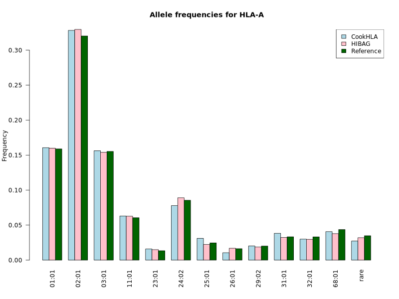
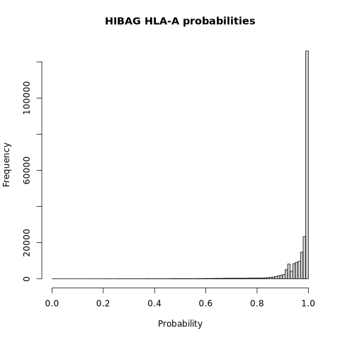
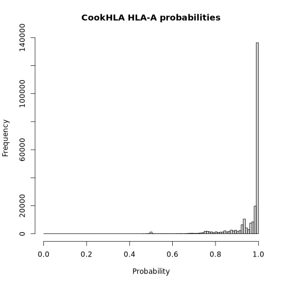
### HLA-B
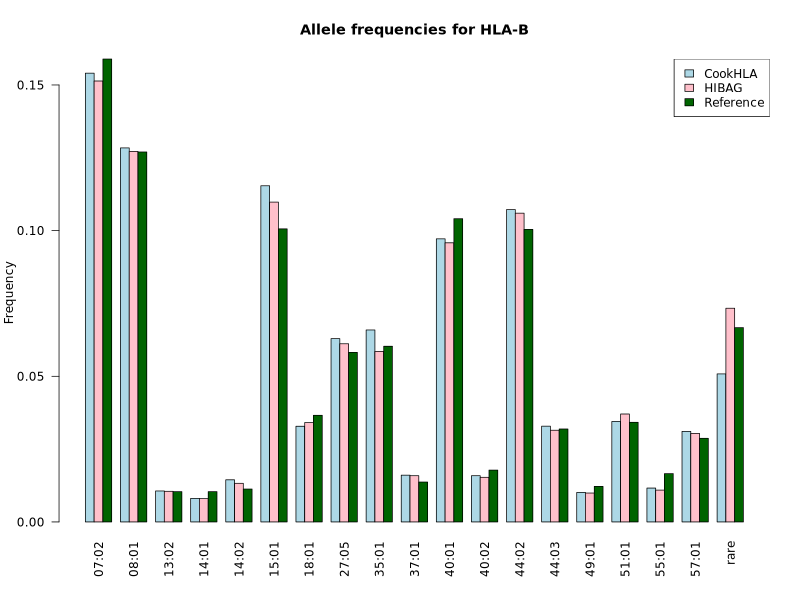
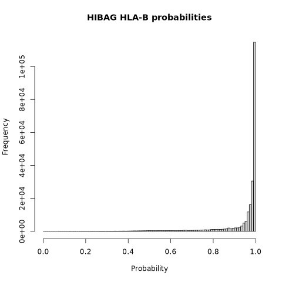
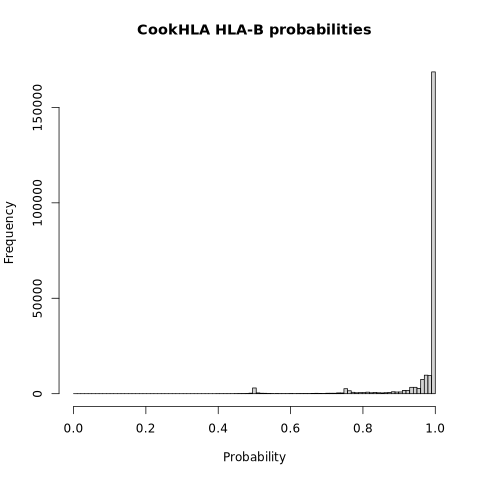
### HLA-C
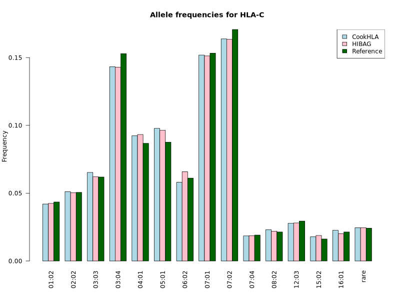
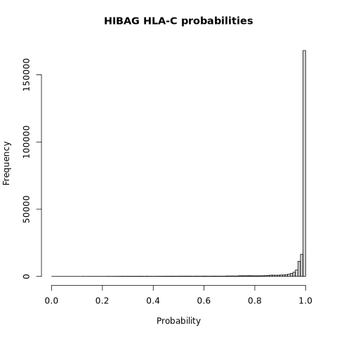
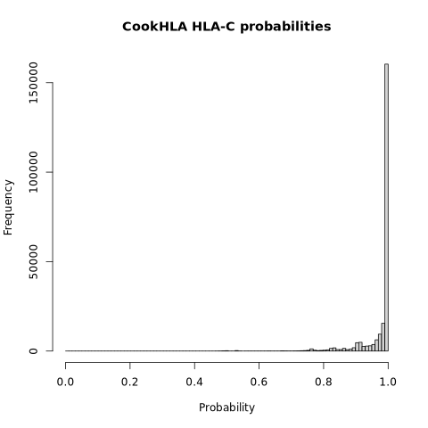
### HLA-DQB1
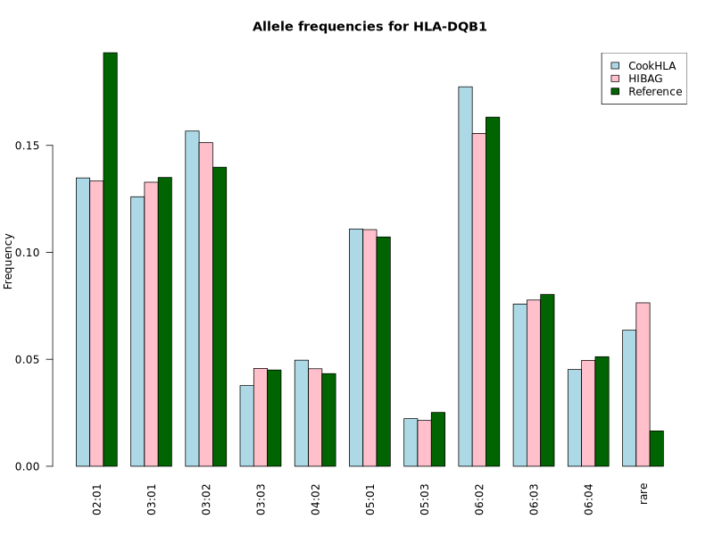
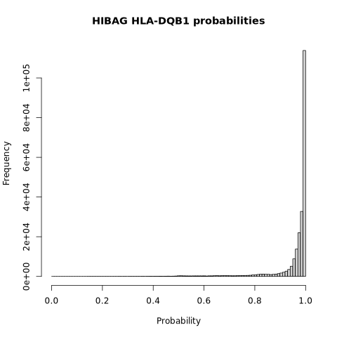
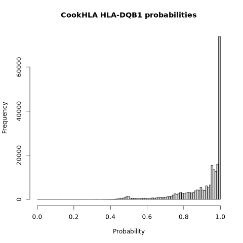
### HLA-DRB1
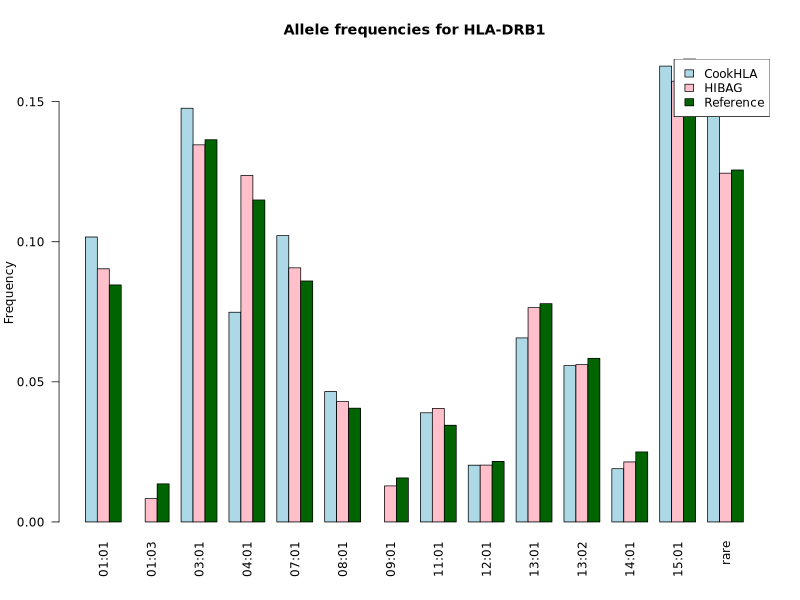
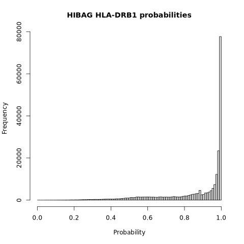
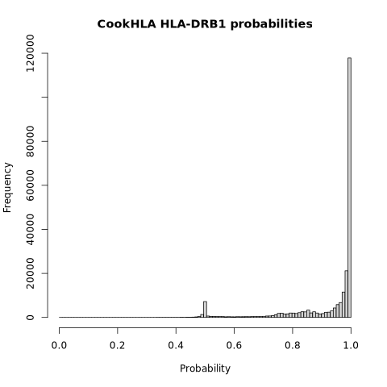
### HLA-DPB1
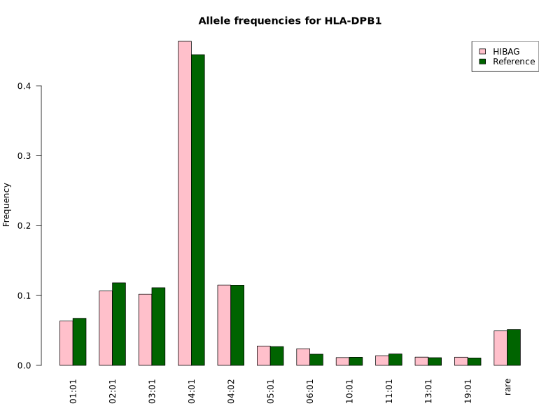
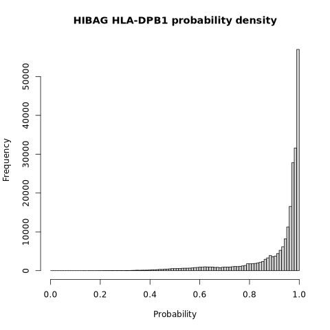
### HLA-DQA1
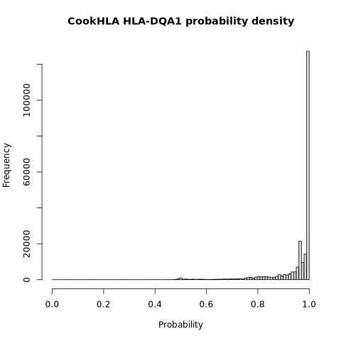
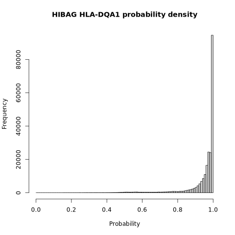
