# HLA imputation report 2026.10.06
## Mendelian errors (trios only)
| HLA | Software | Trios | Errors | Error rate |
| --- | --- | --- | --- | --- |
| A | HIBAG | 43991 | 55 | 0.00125 |
| A | CookHLA | 43991 | 682 | 0.0155 |
| B | HIBAG | 43991 | 226 | 0.00514 |
| B | CookHLA | 43991 | 1295 | 0.02944 |
| C | HIBAG | 43991 | 179 | 0.00407 |
| C | CookHLA | 43991 | 110 | 0.0025 |
| DPB1 | HIBAG | 43991 | 304 | 0.00691 |
| DQA1 | HIBAG | 43991 | 124 | 0.00282 |
| DQA1 | CookHLA | 43991 | 774 | 0.01759 |
| DQB1 | HIBAG | 43991 | 64 | 0.00145 |
| DQB1 | CookHLA | 43991 | 2784 | 0.06329 |
| DRB1 | HIBAG | 43991 | 874 | 0.01987 |
| DRB1 | CookHLA | 43991 | 2163 | 0.04917 |
## HIBAG/CookHLA consistency check
### Number of samples with 0, 1 and 2 inconsistent alleles between HIBAG and CookHLA
| HLA | 0 | 1 | 2 |
| --- | --- | --- | --- |
| A | 191211 | 15890 | 308 |
| B | 188389 | 18599 | 421 |
| C | 196868 | 10408 | 133 |
| DQA1 | 134069 | 65562 | 7778 |
| DQB1 | 152540 | 51572 | 3297 |
| DRB1 | 158728 | 45997 | 2684 |
### Aggregated single inconsistency counts per allele (rows = HIBAG, columns = CookHLA)
### HLA-A
|   | 01:01 | 02:01 | 02:05 | 02:06 | 03:01 | 11:01 | 23:01 | 24:02 | 24:03 | 25:01 | 26:01 | 29:02 | 30:01 | 30:02 | 31:01 | 32:01 | 68:01 |
|---|------|------|------|------|------|------|------|------|------|------|------|------|------|------|------|------|---------|
| 01:01 | 0 | 19 | 1 | 0 | 3 | 83 | 0 | 3 | 0 | 3 | 0 | 0 | 0 | 0 | 23 | 4 | 0 |
| 01:02 | 30 | 0 | 0 | 0 | 0 | 0 | 0 | 0 | 0 | 0 | 0 | 0 | 0 | 0 | 0 | 0 | 0 |
| 02:01 | 72 | 0 | 3 | 529 | 48 | 87 | 68 | 34 | 1 | 25 | 4 | 12 | 2 | 3 | 156 | 28 | 49 |
| 02:02 | 0 | 1 | 24 | 0 | 1 | 0 | 0 | 0 | 0 | 7 | 0 | 0 | 0 | 0 | 1 | 1 | 0 |
| 02:05 | 0 | 1 | 0 | 0 | 1 | 0 | 0 | 0 | 0 | 0 | 0 | 0 | 0 | 0 | 0 | 0 | 37 |
| 02:06 | 0 | 13 | 0 | 0 | 0 | 0 | 0 | 0 | 0 | 0 | 0 | 0 | 0 | 0 | 0 | 0 | 0 |
| 03:01 | 298 | 61 | 0 | 1 | 0 | 84 | 0 | 9 | 0 | 0 | 0 | 0 | 0 | 5 | 1 | 2 | 5 |
| 11:01 | 36 | 55 | 2 | 0 | 72 | 0 | 6 | 8 | 0 | 2 | 0 | 6 | 1 | 0 | 9 | 4 | 2 |
| 23:01 | 8 | 1 | 0 | 0 | 0 | 1 | 0 | 6 | 0 | 0 | 0 | 0 | 0 | 0 | 0 | 0 | 0 |
| 24:02 | 147 | 407 | 3 | 0 | 205 | 43 | 9 | 0 | 2002 | 15 | 4 | 17 | 0 | 4 | 23 | 33 | 23 |
| 25:01 | 0 | 0 | 1 | 0 | 0 | 1 | 0 | 0 | 0 | 0 | 800 | 0 | 0 | 0 | 1 | 0 | 0 |
| 26:01 | 30 | 64 | 2 | 0 | 45 | 13 | 4 | 15 | 3 | 4267 | 0 | 2 | 1 | 1 | 5 | 8 | 8 |
| 29:01 | 0 | 4 | 0 | 0 | 1 | 1 | 0 | 1 | 0 | 0 | 0 | 419 | 0 | 0 | 0 | 1 | 0 |
| 29:02 | 0 | 2 | 0 | 0 | 0 | 0 | 0 | 0 | 0 | 0 | 0 | 0 | 0 | 0 | 0 | 1 | 0 |
| 30:01 | 1 | 2 | 0 | 0 | 4 | 0 | 0 | 0 | 0 | 1 | 0 | 0 | 0 | 0 | 0 | 0 | 0 |
| 30:02 | 6 | 73 | 0 | 0 | 13 | 1 | 2 | 1 | 0 | 0 | 1 | 0 | 0 | 0 | 4 | 1 | 0 |
| 30:04 | 94 | 108 | 2 | 0 | 234 | 22 | 13 | 42 | 0 | 1 | 2 | 11 | 1 | 1 | 19 | 8 | 7 |
| 31:01 | 5 | 11 | 0 | 0 | 0 | 2 | 0 | 1 | 0 | 1 | 0 | 0 | 0 | 0 | 0 | 0 | 1 |
| 32:01 | 13 | 14 | 0 | 0 | 1 | 0 | 11 | 1 | 0 | 0 | 0 | 0 | 0 | 0 | 0 | 0 | 0 |
| 33:01 | 0 | 0 | 0 | 0 | 0 | 0 | 0 | 0 | 0 | 0 | 0 | 0 | 0 | 0 | 997 | 0 | 0 |
| 33:03 | 0 | 0 | 0 | 0 | 0 | 0 | 0 | 0 | 0 | 0 | 0 | 0 | 0 | 0 | 464 | 0 | 0 |
| 34:02 | 32 | 88 | 0 | 0 | 39 | 12 | 2 | 17 | 0 | 3 | 2 | 2 | 1 | 2 | 9 | 7 | 10 |
| 66:01 | 0 | 0 | 0 | 0 | 0 | 0 | 0 | 0 | 0 | 139 | 911 | 1 | 1 | 0 | 1 | 0 | 0 |
| 68:01 | 10 | 176 | 1 | 0 | 11 | 10 | 5 | 6 | 0 | 0 | 1 | 3 | 1 | 0 | 11 | 4 | 0 |
| 68:02 | 0 | 0 | 0 | 0 | 0 | 0 | 0 | 0 | 0 | 0 | 0 | 0 | 1 | 0 | 0 | 0 | 889 |
| 69:01 | 2 | 103 | 0 | 0 | 1 | 0 | 0 | 2 | 0 | 0 | 0 | 0 | 3 | 0 | 0 | 0 | 432 |
| 74:01 | 0 | 0 | 0 | 0 | 0 | 0 | 0 | 0 | 0 | 0 | 0 | 0 | 0 | 0 | 0 | 2 | 0 |
| 74:03 | 0 | 0 | 0 | 0 | 0 | 0 | 0 | 0 | 0 | 0 | 0 | 0 | 0 | 0 | 0 | 42 | 0 |
### HLA-B
|   | 07:02 | 08:01 | 13:02 | 14:01 | 14:02 | 15:01 | 15:10 | 18:01 | 27:05 | 35:01 | 35:03 | 37:01 | 38:01 | 39:06 | 40:01 | 40:02 | 41:01 | 44:02 | 44:03 | 44:04 | 44:05 | 49:01 | 50:01 | 51:01 | 52:01 | 55:01 | 56:01 | 57:01 | 58:01 |
|---|------|------|------|------|------|------|------|------|------|------|------|------|------|------|------|------|------|------|------|------|------|------|------|------|------|------|------|------|---------|
| 07:02 | 0 | 104 | 6 | 1 | 0 | 2 | 0 | 3 | 1 | 1 | 0 | 1 | 0 | 3 | 6 | 0 | 0 | 0 | 2 | 0 | 60 | 2 | 0 | 8 | 0 | 3 | 0 | 0 | 0 |
| 07:05 | 205 | 3 | 2 | 0 | 0 | 9 | 0 | 0 | 3 | 1 | 0 | 0 | 0 | 0 | 6 | 2 | 0 | 4 | 0 | 0 | 0 | 0 | 0 | 1 | 0 | 1 | 0 | 1 | 0 |
| 08:01 | 82 | 0 | 0 | 0 | 1 | 10 | 0 | 74 | 1 | 1 | 0 | 0 | 0 | 0 | 1 | 1 | 0 | 7 | 5 | 0 | 1 | 0 | 0 | 1 | 6 | 2 | 0 | 20 | 4 |
| 13:02 | 49 | 6 | 0 | 7 | 0 | 2 | 0 | 1 | 0 | 1 | 0 | 1 | 0 | 0 | 1 | 0 | 0 | 1 | 0 | 0 | 0 | 1 | 1 | 0 | 0 | 1 | 0 | 2 | 1 |
| 14:01 | 0 | 2 | 0 | 0 | 32 | 0 | 0 | 0 | 0 | 0 | 0 | 0 | 0 | 1 | 0 | 1 | 0 | 0 | 0 | 0 | 0 | 0 | 0 | 0 | 0 | 0 | 0 | 0 | 0 |
| 14:02 | 0 | 5 | 0 | 0 | 0 | 4 | 0 | 2 | 3 | 1 | 0 | 0 | 0 | 1 | 2 | 1 | 0 | 3 | 2 | 0 | 0 | 0 | 0 | 1 | 0 | 1 | 0 | 0 | 0 |
| 15:01 | 6 | 16 | 0 | 0 | 3 | 0 | 0 | 9 | 3 | 99 | 1 | 1 | 0 | 0 | 21 | 0 | 5 | 52 | 3 | 0 | 0 | 0 | 2 | 9 | 0 | 0 | 1 | 1 | 0 |
| 15:02 | 0 | 0 | 0 | 0 | 0 | 1 | 0 | 0 | 0 | 0 | 0 | 0 | 0 | 0 | 0 | 0 | 0 | 0 | 0 | 0 | 0 | 0 | 0 | 0 | 0 | 0 | 0 | 0 | 0 |
| 15:03 | 3 | 2 | 0 | 0 | 0 | 3 | 0 | 0 | 1 | 2 | 0 | 0 | 0 | 0 | 0 | 1 | 0 | 1 | 1 | 0 | 71 | 0 | 0 | 0 | 99 | 0 | 0 | 1 | 0 |
| 15:08 | 0 | 0 | 0 | 0 | 0 | 2 | 0 | 0 | 0 | 0 | 0 | 0 | 0 | 0 | 0 | 0 | 0 | 0 | 0 | 0 | 0 | 0 | 0 | 0 | 0 | 0 | 0 | 0 | 0 |
| 15:10 | 0 | 0 | 0 | 0 | 0 | 17 | 0 | 0 | 0 | 0 | 0 | 0 | 0 | 0 | 0 | 0 | 0 | 0 | 2 | 0 | 0 | 0 | 0 | 0 | 0 | 0 | 0 | 0 | 0 |
| 15:16 | 32 | 20 | 2 | 1 | 2 | 8 | 0 | 1 | 4 | 3 | 1 | 3 | 1 | 1 | 9 | 3 | 0 | 10 | 1 | 0 | 0 | 0 | 0 | 7 | 0 | 0 | 0 | 3 | 0 |
| 15:17 | 3 | 9 | 0 | 0 | 0 | 106 | 8 | 1 | 6 | 5 | 0 | 2 | 0 | 1 | 5 | 0 | 18 | 4 | 2 | 0 | 0 | 0 | 0 | 3 | 0 | 1 | 0 | 1 | 0 |
| 15:18 | 28 | 17 | 5 | 0 | 3 | 107 | 0 | 10 | 23 | 7 | 0 | 4 | 4 | 0 | 33 | 6 | 0 | 92 | 14 | 0 | 1 | 1 | 4 | 96 | 0 | 2 | 2 | 12 | 1 |
| 18:01 | 54 | 17 | 0 | 0 | 0 | 4 | 0 | 0 | 6 | 2 | 1 | 1 | 77 | 0 | 4 | 0 | 0 | 3 | 3 | 0 | 0 | 0 | 0 | 1 | 653 | 0 | 2 | 0 | 0 |
| 18:03 | 0 | 0 | 0 | 0 | 0 | 1 | 0 | 1 | 0 | 0 | 0 | 0 | 0 | 0 | 1 | 0 | 0 | 0 | 0 | 0 | 0 | 0 | 0 | 0 | 13 | 0 | 0 | 0 | 0 |
| 18:18 | 0 | 0 | 0 | 0 | 0 | 0 | 0 | 43 | 0 | 0 | 0 | 0 | 0 | 0 | 0 | 0 | 0 | 0 | 0 | 0 | 0 | 0 | 0 | 0 | 0 | 0 | 0 | 0 | 0 |
| 27:02 | 0 | 0 | 0 | 0 | 0 | 0 | 0 | 0 | 698 | 0 | 0 | 0 | 0 | 1 | 0 | 1 | 0 | 3 | 0 | 0 | 0 | 0 | 0 | 0 | 0 | 0 | 0 | 0 | 0 |
| 27:05 | 8 | 5 | 0 | 1 | 2 | 2 | 0 | 1 | 0 | 1 | 0 | 0 | 2 | 1 | 3 | 1 | 0 | 3 | 1 | 1 | 0 | 0 | 51 | 6 | 0 | 3 | 0 | 0 | 1 |
| 35:01 | 205 | 201 | 7 | 9 | 14 | 171 | 0 | 32 | 92 | 0 | 25 | 20 | 6 | 9 | 161 | 28 | 3 | 142 | 31 | 0 | 2 | 9 | 8 | 25 | 1 | 13 | 4 | 33 | 4 |
| 35:02 | 10 | 17 | 1 | 1 | 0 | 12 | 0 | 2 | 3 | 486 | 0 | 2 | 0 | 1 | 6 | 0 | 3 | 10 | 4 | 0 | 0 | 1 | 2 | 3 | 0 | 0 | 1 | 7 | 2 |
| 35:03 | 24 | 84 | 8 | 7 | 9 | 132 | 0 | 22 | 34 | 587 | 0 | 12 | 14 | 9 | 59 | 7 | 1 | 83 | 30 | 0 | 1 | 6 | 1 | 40 | 2 | 6 | 1 | 23 | 1 |
| 35:08 | 1 | 6 | 2 | 1 | 1 | 5 | 0 | 0 | 1 | 733 | 0 | 0 | 0 | 0 | 2 | 0 | 1 | 8 | 0 | 0 | 0 | 0 | 0 | 1 | 0 | 0 | 0 | 1 | 3 |
| 37:01 | 2 | 0 | 4 | 0 | 1 | 0 | 0 | 2 | 1 | 1 | 0 | 0 | 0 | 0 | 0 | 10 | 0 | 0 | 0 | 0 | 0 | 0 | 0 | 0 | 0 | 0 | 0 | 0 | 0 |
| 38:01 | 0 | 0 | 0 | 0 | 0 | 1 | 0 | 1 | 1 | 2 | 1 | 1 | 0 | 10 | 1 | 0 | 0 | 5 | 0 | 0 | 0 | 1 | 1 | 0 | 0 | 0 | 0 | 0 | 0 |
| 39:01 | 59 | 52 | 8 | 3 | 6 | 52 | 0 | 30 | 26 | 19 | 1 | 4 | 858 | 1118 | 54 | 5 | 0 | 51 | 18 | 0 | 1 | 3 | 0 | 14 | 0 | 8 | 3 | 14 | 1 |
| 39:06 | 2 | 0 | 0 | 0 | 0 | 0 | 0 | 0 | 1 | 0 | 0 | 0 | 0 | 0 | 1 | 0 | 0 | 0 | 0 | 0 | 0 | 0 | 0 | 1 | 0 | 0 | 0 | 0 | 0 |
| 39:24 | 10 | 7 | 0 | 2 | 2 | 4 | 0 | 0 | 3 | 4 | 0 | 0 | 0 | 0 | 3 | 2 | 0 | 4 | 2 | 0 | 0 | 1 | 0 | 2 | 0 | 1 | 0 | 0 | 0 |
| 40:01 | 1 | 4 | 0 | 0 | 0 | 53 | 0 | 4 | 0 | 3 | 0 | 0 | 0 | 0 | 0 | 0 | 0 | 20 | 3 | 0 | 0 | 0 | 0 | 0 | 0 | 0 | 0 | 1 | 0 |
| 40:02 | 0 | 1 | 0 | 0 | 0 | 0 | 0 | 0 | 10 | 0 | 0 | 25 | 0 | 2 | 0 | 0 | 0 | 0 | 0 | 0 | 0 | 0 | 0 | 1 | 0 | 0 | 0 | 0 | 0 |
| 40:06 | 0 | 0 | 0 | 0 | 0 | 0 | 0 | 0 | 0 | 0 | 0 | 0 | 0 | 0 | 0 | 58 | 0 | 0 | 0 | 0 | 0 | 0 | 0 | 0 | 0 | 0 | 0 | 0 | 0 |
| 41:01 | 0 | 0 | 0 | 0 | 0 | 0 | 0 | 0 | 0 | 0 | 0 | 0 | 0 | 0 | 1 | 0 | 0 | 0 | 0 | 0 | 0 | 0 | 0 | 0 | 0 | 0 | 0 | 0 | 0 |
| 41:02 | 0 | 0 | 0 | 0 | 0 | 0 | 0 | 0 | 0 | 0 | 0 | 0 | 0 | 0 | 0 | 0 | 791 | 1 | 0 | 0 | 0 | 0 | 0 | 0 | 0 | 0 | 0 | 0 | 0 |
| 42:02 | 0 | 0 | 0 | 0 | 0 | 0 | 0 | 0 | 0 | 0 | 0 | 0 | 0 | 0 | 0 | 0 | 4 | 0 | 0 | 0 | 0 | 0 | 0 | 0 | 0 | 0 | 0 | 0 | 0 |
| 44:02 | 36 | 71 | 3 | 1 | 2 | 48 | 0 | 7 | 15 | 21 | 1 | 3 | 1 | 2 | 75 | 5 | 0 | 0 | 10 | 0 | 20 | 4 | 0 | 13 | 0 | 0 | 0 | 18 | 0 |
| 44:03 | 11 | 12 | 0 | 0 | 0 | 11 | 0 | 3 | 7 | 9 | 2 | 2 | 0 | 0 | 14 | 5 | 0 | 14 | 0 | 131 | 1 | 102 | 2 | 7 | 1 | 4 | 0 | 4 | 1 |
| 44:05 | 0 | 1 | 0 | 0 | 0 | 0 | 0 | 0 | 0 | 0 | 0 | 0 | 0 | 0 | 1 | 0 | 0 | 12 | 0 | 0 | 0 | 1 | 0 | 0 | 0 | 0 | 0 | 0 | 0 |
| 45:01 | 7 | 9 | 1 | 0 | 4 | 21 | 0 | 5 | 9 | 6 | 0 | 1 | 1 | 1 | 9 | 1 | 1 | 8 | 258 | 12 | 0 | 2 | 1371 | 1 | 0 | 2 | 0 | 1 | 0 |
| 46:01 | 0 | 0 | 0 | 0 | 0 | 1 | 0 | 0 | 0 | 0 | 0 | 0 | 0 | 0 | 0 | 0 | 0 | 0 | 0 | 0 | 0 | 0 | 0 | 0 | 0 | 0 | 0 | 0 | 0 |
| 47:01 | 104 | 230 | 15 | 14 | 21 | 128 | 0 | 29 | 68 | 53 | 5 | 13 | 4 | 5 | 100 | 21 | 2 | 116 | 29 | 0 | 1 | 14 | 8 | 38 | 83 | 13 | 3 | 82 | 1 |
| 48:01 | 89 | 70 | 11 | 6 | 455 | 1 | 0 | 21 | 14 | 0 | 0 | 12 | 1 | 5 | 0 | 5 | 0 | 1 | 0 | 0 | 0 | 0 | 0 | 0 | 1 | 6 | 4 | 0 | 0 |
| 49:01 | 2 | 0 | 0 | 0 | 0 | 0 | 0 | 1 | 0 | 1 | 0 | 1 | 0 | 0 | 0 | 0 | 0 | 0 | 8 | 0 | 0 | 0 | 0 | 0 | 0 | 0 | 1 | 0 | 0 |
| 50:01 | 12 | 16 | 0 | 1 | 0 | 25 | 0 | 6 | 7 | 7 | 0 | 2 | 1 | 1 | 10 | 1 | 1 | 10 | 7 | 0 | 0 | 12 | 0 | 7 | 0 | 2 | 0 | 2 | 1 |
| 51:01 | 90 | 79 | 4 | 4 | 5 | 284 | 0 | 19 | 32 | 26 | 37 | 3 | 2 | 4 | 49 | 9 | 174 | 76 | 507 | 0 | 0 | 6 | 0 | 0 | 42 | 9 | 4 | 14 | 1 |
| 51:07 | 0 | 0 | 0 | 0 | 0 | 0 | 0 | 0 | 0 | 0 | 0 | 0 | 0 | 0 | 0 | 0 | 0 | 0 | 0 | 0 | 0 | 0 | 0 | 9 | 0 | 0 | 0 | 0 | 0 |
| 51:08 | 0 | 0 | 0 | 0 | 0 | 2 | 0 | 0 | 0 | 0 | 0 | 0 | 0 | 0 | 0 | 0 | 0 | 0 | 32 | 0 | 0 | 0 | 0 | 0 | 0 | 0 | 0 | 0 | 0 |
| 52:01 | 0 | 0 | 0 | 0 | 0 | 0 | 0 | 0 | 0 | 0 | 0 | 0 | 0 | 0 | 0 | 0 | 0 | 0 | 0 | 0 | 0 | 0 | 0 | 8 | 0 | 0 | 0 | 0 | 0 |
| 53:01 | 0 | 0 | 0 | 0 | 0 | 0 | 0 | 0 | 0 | 489 | 0 | 0 | 0 | 0 | 0 | 0 | 0 | 0 | 3 | 0 | 0 | 0 | 0 | 0 | 0 | 0 | 0 | 0 | 0 |
| 54:01 | 0 | 0 | 0 | 0 | 0 | 0 | 0 | 0 | 0 | 0 | 0 | 0 | 0 | 0 | 0 | 0 | 0 | 0 | 0 | 0 | 0 | 0 | 0 | 0 | 0 | 0 | 2 | 0 | 0 |
| 55:01 | 0 | 1 | 1 | 0 | 1 | 0 | 0 | 1 | 0 | 1 | 0 | 0 | 0 | 0 | 0 | 0 | 0 | 0 | 0 | 0 | 0 | 0 | 0 | 0 | 0 | 0 | 85 | 1 | 0 |
| 55:02 | 0 | 0 | 0 | 0 | 0 | 0 | 0 | 0 | 0 | 0 | 0 | 0 | 0 | 0 | 0 | 0 | 0 | 0 | 0 | 0 | 0 | 0 | 0 | 0 | 0 | 0 | 1 | 0 | 0 |
| 56:01 | 0 | 0 | 0 | 0 | 0 | 0 | 0 | 0 | 0 | 1 | 0 | 0 | 0 | 2 | 4 | 0 | 0 | 0 | 0 | 0 | 0 | 0 | 0 | 0 | 0 | 415 | 0 | 0 | 0 |
| 57:01 | 4 | 1 | 0 | 0 | 0 | 8 | 0 | 0 | 1 | 6 | 0 | 0 | 0 | 2 | 19 | 0 | 0 | 4 | 0 | 0 | 0 | 0 | 0 | 5 | 0 | 1 | 0 | 0 | 0 |
| 57:03 | 0 | 0 | 0 | 0 | 0 | 0 | 0 | 0 | 0 | 0 | 0 | 0 | 0 | 0 | 0 | 0 | 0 | 0 | 0 | 0 | 0 | 0 | 0 | 0 | 0 | 0 | 0 | 14 | 0 |
| 58:01 | 0 | 2 | 0 | 0 | 1 | 2 | 0 | 0 | 1 | 474 | 0 | 0 | 0 | 0 | 0 | 0 | 0 | 1 | 0 | 0 | 0 | 0 | 0 | 0 | 0 | 0 | 0 | 0 | 0 |
| 73:01 | 0 | 0 | 0 | 0 | 3 | 0 | 0 | 0 | 0 | 0 | 0 | 48 | 0 | 0 | 0 | 0 | 0 | 0 | 0 | 0 | 0 | 0 | 0 | 6 | 0 | 0 | 0 | 0 | 0 |
| 81:01 | 1 | 0 | 0 | 0 | 0 | 0 | 0 | 0 | 0 | 0 | 0 | 0 | 0 | 0 | 0 | 0 | 0 | 0 | 0 | 0 | 0 | 0 | 0 | 0 | 0 | 0 | 0 | 0 | 0 |
### HLA-C
|   | 01:02 | 02:02 | 03:03 | 03:04 | 04:01 | 05:01 | 06:02 | 06:06 | 07:01 | 07:02 | 07:04 | 08:02 | 12:02 | 12:03 | 14:02 | 15:02 | 16:01 | 17:01 |
|---|------|------|------|------|------|------|------|------|------|------|------|------|------|------|------|------|------|---------|
| 01:02 | 0 | 3 | 3 | 11 | 5 | 2 | 0 | 0 | 6 | 4 | 1 | 0 | 0 | 1 | 0 | 29 | 0 | 0 |
| 02:02 | 13 | 0 | 2 | 6 | 4 | 2 | 1 | 0 | 7 | 7 | 1 | 4 | 0 | 0 | 0 | 1 | 4 | 0 |
| 02:10 | 0 | 77 | 0 | 0 | 0 | 0 | 0 | 0 | 0 | 0 | 0 | 0 | 0 | 0 | 0 | 0 | 0 | 0 |
| 03:02 | 0 | 0 | 459 | 28 | 0 | 0 | 0 | 0 | 0 | 0 | 0 | 0 | 0 | 0 | 0 | 0 | 0 | 0 |
| 03:03 | 0 | 13 | 0 | 3314 | 5 | 2 | 0 | 0 | 2 | 0 | 0 | 0 | 0 | 0 | 0 | 0 | 0 | 0 |
| 03:04 | 0 | 1 | 110 | 0 | 5 | 1 | 0 | 0 | 9 | 0 | 0 | 1 | 0 | 0 | 0 | 3 | 0 | 0 |
| 03:05 | 0 | 0 | 0 | 1 | 0 | 0 | 0 | 0 | 0 | 0 | 0 | 0 | 0 | 0 | 0 | 0 | 0 | 0 |
| 03:10 | 0 | 0 | 13 | 87 | 0 | 0 | 0 | 0 | 0 | 0 | 0 | 0 | 0 | 0 | 0 | 0 | 0 | 0 |
| 04:01 | 0 | 49 | 5 | 30 | 0 | 75 | 0 | 0 | 21 | 2 | 0 | 7 | 36 | 0 | 14 | 2 | 37 | 207 |
| 05:01 | 0 | 1 | 0 | 0 | 0 | 0 | 4 | 0 | 0 | 0 | 0 | 7 | 0 | 0 | 0 | 0 | 0 | 0 |
| 06:02 | 0 | 0 | 0 | 0 | 1 | 0 | 0 | 3009 | 0 | 0 | 0 | 2 | 0 | 5 | 1 | 0 | 0 | 0 |
| 07:01 | 1 | 6 | 0 | 0 | 0 | 0 | 0 | 0 | 0 | 19 | 0 | 0 | 0 | 0 | 0 | 0 | 0 | 0 |
| 07:02 | 0 | 0 | 0 | 3 | 13 | 0 | 1 | 0 | 122 | 0 | 0 | 1 | 0 | 0 | 0 | 0 | 0 | 0 |
| 07:04 | 0 | 4 | 1 | 2 | 2 | 0 | 1 | 0 | 1 | 3 | 0 | 1 | 0 | 1 | 0 | 1 | 0 | 0 |
| 08:01 | 0 | 0 | 0 | 0 | 0 | 0 | 0 | 0 | 0 | 0 | 0 | 177 | 0 | 0 | 0 | 0 | 0 | 0 |
| 08:02 | 0 | 0 | 0 | 0 | 0 | 27 | 0 | 0 | 0 | 0 | 0 | 0 | 0 | 0 | 0 | 0 | 0 | 0 |
| 08:03 | 0 | 0 | 0 | 0 | 0 | 1 | 0 | 0 | 0 | 0 | 0 | 287 | 0 | 0 | 0 | 0 | 0 | 0 |
| 12:03 | 0 | 2 | 0 | 0 | 0 | 4 | 18 | 0 | 8 | 5 | 0 | 0 | 0 | 0 | 4 | 45 | 1 | 0 |
| 14:02 | 0 | 0 | 0 | 2 | 2 | 1 | 4 | 0 | 0 | 1 | 0 | 0 | 4 | 0 | 0 | 1 | 0 | 0 |
| 14:03 | 0 | 0 | 0 | 0 | 0 | 0 | 0 | 0 | 0 | 0 | 0 | 0 | 0 | 0 | 35 | 0 | 0 | 0 |
| 15:02 | 1 | 10 | 90 | 426 | 3 | 1 | 0 | 0 | 4 | 2 | 0 | 0 | 0 | 0 | 4 | 0 | 252 | 1 |
| 15:04 | 0 | 0 | 0 | 0 | 0 | 0 | 0 | 0 | 0 | 0 | 0 | 0 | 0 | 0 | 0 | 65 | 0 | 0 |
| 15:05 | 0 | 0 | 3 | 2 | 0 | 1 | 1 | 0 | 1 | 1 | 0 | 0 | 0 | 0 | 0 | 252 | 1 | 0 |
| 15:11 | 0 | 138 | 0 | 0 | 0 | 0 | 0 | 0 | 0 | 0 | 0 | 0 | 0 | 0 | 0 | 0 | 0 | 0 |
| 16:01 | 0 | 0 | 1 | 12 | 2 | 0 | 0 | 0 | 0 | 0 | 1 | 0 | 0 | 0 | 0 | 0 | 0 | 19 |
| 16:02 | 0 | 0 | 0 | 0 | 1 | 0 | 0 | 0 | 1 | 0 | 0 | 0 | 0 | 0 | 1 | 0 | 381 | 0 |
| 16:04 | 0 | 0 | 0 | 0 | 0 | 0 | 0 | 0 | 0 | 0 | 0 | 0 | 0 | 0 | 0 | 0 | 148 | 0 |
| 17:01 | 0 | 0 | 0 | 0 | 0 | 0 | 2 | 0 | 2 | 0 | 0 | 0 | 0 | 0 | 0 | 0 | 0 | 0 |
| 18:01 | 0 | 0 | 0 | 0 | 0 | 3 | 0 | 0 | 0 | 0 | 0 | 0 | 0 | 0 | 0 | 0 | 0 | 0 |
### HLA-DQA1
|   | 01:01 | 01:02 | 01:03 | 02:01 | 03:01 | 04:01 | 05:01 |
|---|------|------|------|------|------|------|---------|
| 01:01 | 0 | 79 | 2 | 1 | 1 | 1 | 2 |
| 01:02 | 97 | 0 | 1042 | 45 | 74 | 10 | 611 |
| 01:03 | 42 | 1479 | 0 | 14 | 15 | 7 | 451 |
| 01:04 | 6596 | 228 | 45 | 3 | 6 | 1 | 19 |
| 01:05 | 2942 | 41 | 0 | 0 | 0 | 0 | 2 |
| 02:01 | 17 | 118 | 25 | 0 | 80 | 8 | 55 |
| 03:01 | 2 | 20 | 3 | 0 | 0 | 187 | 107 |
| 03:02 | 21 | 575 | 191 | 2969 | 270 | 6 | 284 |
| 03:03 | 27 | 45 | 15 | 22 | 20526 | 268 | 169 |
| 04:01 | 0 | 1 | 0 | 2 | 12 | 0 | 0 |
| 05:01 | 4 | 1148 | 463 | 67 | 92 | 2 | 0 |
| 05:05 | 155 | 147 | 49 | 171 | 583 | 3 | 22028 |
| 05:09 | 0 | 0 | 0 | 0 | 60 | 0 | 0 |
| 06:01 | 6 | 15 | 6 | 186 | 208 | 4 | 284 |
### HLA-DQB1
|   | 02:01 | 02:02 | 03:01 | 03:02 | 03:03 | 03:05 | 04:02 | 05:01 | 05:02 | 05:03 | 06:01 | 06:02 | 06:03 | 06:04 | 06:09 |
|---|------|------|------|------|------|------|------|------|------|------|------|------|------|------|---------|
| 02:01 | 0 | 114 | 1368 | 374 | 316 | 0 | 260 | 748 | 6 | 127 | 0 | 1047 | 571 | 60 | 0 |
| 02:02 | 225 | 0 | 304 | 142 | 23 | 0 | 212 | 490 | 1 | 24 | 0 | 1392 | 221 | 35 | 0 |
| 03:01 | 488 | 214 | 0 | 2089 | 1502 | 3 | 333 | 659 | 91 | 2002 | 6 | 2136 | 547 | 226 | 0 |
| 03:02 | 949 | 533 | 255 | 0 | 96 | 28 | 854 | 307 | 7 | 436 | 5 | 1196 | 453 | 72 | 1 |
| 03:03 | 303 | 76 | 651 | 239 | 0 | 0 | 130 | 150 | 372 | 51 | 4 | 779 | 1572 | 97 | 4 |
| 03:04 | 3 | 8 | 71 | 319 | 9 | 0 | 2 | 3 | 1 | 2 | 0 | 39 | 4 | 6 | 0 |
| 03:19 | 1 | 0 | 0 | 0 | 0 | 0 | 0 | 0 | 0 | 0 | 0 | 15 | 0 | 0 | 0 |
| 04:02 | 160 | 26 | 163 | 164 | 35 | 0 | 0 | 54 | 2 | 21 | 1 | 517 | 228 | 82 | 0 |
| 05:01 | 268 | 193 | 455 | 544 | 252 | 0 | 265 | 0 | 4 | 44 | 2 | 1008 | 847 | 83 | 1 |
| 05:02 | 12 | 8 | 237 | 16 | 39 | 0 | 3 | 24 | 0 | 6 | 1 | 40 | 45 | 5 | 0 |
| 05:03 | 36 | 11 | 591 | 988 | 43 | 1 | 149 | 389 | 2 | 0 | 0 | 357 | 63 | 6 | 0 |
| 05:04 | 2 | 495 | 2 | 0 | 0 | 0 | 1 | 0 | 0 | 5 | 0 | 1 | 1 | 0 | 0 |
| 06:01 | 3 | 10 | 13 | 47 | 4 | 0 | 1 | 2 | 0 | 0 | 0 | 15 | 3 | 0 | 0 |
| 06:02 | 260 | 71 | 938 | 691 | 402 | 0 | 149 | 953 | 17 | 381 | 0 | 0 | 1079 | 163 | 0 |
| 06:03 | 338 | 117 | 1867 | 491 | 149 | 0 | 542 | 218 | 43 | 199 | 2 | 1942 | 0 | 88 | 0 |
| 06:04 | 254 | 43 | 415 | 168 | 29 | 0 | 137 | 45 | 6 | 56 | 0 | 888 | 565 | 0 | 2 |
| 06:09 | 54 | 4 | 53 | 24 | 14 | 0 | 2 | 13 | 1 | 2 | 0 | 118 | 21 | 3 | 0 |
### HLA-DRB1
|   | 01:01 | 03:01 | 04:01 | 04:02 | 04:03 | 04:04 | 04:05 | 04:07 | 07:01 | 08:01 | 10:01 | 11:01 | 11:03 | 11:04 | 12:01 | 13:01 | 13:02 | 13:03 | 14:01 | 14:04 | 15:01 | 15:02 | 16:01 |
|---|------|------|------|------|------|------|------|------|------|------|------|------|------|------|------|------|------|------|------|------|------|------|---------|
| 01:01 | 0 | 77 | 39 | 0 | 0 | 46 | 1 | 13 | 44 | 30 | 7 | 19 | 0 | 0 | 10 | 38 | 33 | 0 | 12 | 0 | 155 | 1 | 6 |
| 01:02 | 424 | 165 | 76 | 2 | 4 | 64 | 0 | 13 | 254 | 61 | 19 | 30 | 0 | 0 | 23 | 69 | 57 | 9 | 23 | 0 | 186 | 0 | 8 |
| 01:03 | 2926 | 3 | 15 | 1 | 0 | 11 | 0 | 2 | 15 | 16 | 5 | 24 | 1 | 0 | 4 | 13 | 11 | 1 | 1 | 0 | 20 | 0 | 4 |
| 03:01 | 39 | 0 | 41 | 2 | 0 | 46 | 0 | 4 | 57 | 12 | 3 | 16 | 0 | 0 | 13 | 16 | 23 | 0 | 6 | 0 | 70 | 0 | 3 |
| 03:02 | 0 | 0 | 0 | 0 | 0 | 0 | 0 | 0 | 0 | 8 | 0 | 0 | 0 | 0 | 0 | 0 | 0 | 0 | 0 | 0 | 0 | 0 | 0 |
| 04:01 | 178 | 92 | 0 | 48 | 261 | 16808 | 0 | 184 | 537 | 68 | 12 | 13 | 0 | 0 | 40 | 75 | 89 | 7 | 9 | 0 | 150 | 5 | 8 |
| 04:02 | 1 | 1 | 68 | 0 | 2 | 39 | 0 | 0 | 0 | 158 | 0 | 0 | 0 | 0 | 0 | 0 | 0 | 0 | 0 | 0 | 1 | 0 | 0 |
| 04:03 | 12 | 14 | 894 | 3 | 0 | 165 | 0 | 22 | 8 | 4 | 2 | 2 | 0 | 0 | 1 | 7 | 4 | 0 | 2 | 0 | 14 | 1 | 0 |
| 04:04 | 9 | 105 | 343 | 72 | 8 | 0 | 0 | 3 | 7 | 12 | 0 | 1 | 0 | 0 | 3 | 4 | 5 | 0 | 1 | 0 | 7 | 0 | 0 |
| 04:05 | 9 | 19 | 166 | 11 | 30 | 938 | 0 | 1 | 13 | 5 | 0 | 3 | 0 | 0 | 2 | 7 | 6 | 1 | 1 | 0 | 13 | 0 | 0 |
| 04:06 | 0 | 0 | 0 | 0 | 0 | 0 | 0 | 0 | 0 | 122 | 0 | 0 | 0 | 0 | 0 | 0 | 0 | 0 | 0 | 0 | 1 | 0 | 0 |
| 04:07 | 3 | 5 | 1167 | 1 | 1 | 69 | 0 | 0 | 24 | 3 | 0 | 0 | 0 | 0 | 0 | 0 | 1 | 0 | 0 | 0 | 5 | 0 | 0 |
| 04:08 | 8 | 3 | 1059 | 0 | 0 | 32 | 0 | 36 | 7 | 5 | 0 | 0 | 0 | 0 | 2 | 1 | 4 | 0 | 0 | 0 | 5 | 0 | 1 |
| 04:10 | 0 | 0 | 0 | 0 | 0 | 0 | 0 | 0 | 0 | 14 | 0 | 0 | 0 | 0 | 0 | 0 | 0 | 0 | 0 | 0 | 0 | 0 | 0 |
| 07:01 | 7 | 12 | 124 | 2 | 0 | 16 | 0 | 14 | 0 | 4 | 0 | 0 | 0 | 0 | 3 | 3 | 2 | 0 | 0 | 0 | 10 | 0 | 1 |
| 08:01 | 3 | 6 | 11 | 0 | 0 | 4 | 0 | 0 | 5 | 0 | 0 | 2 | 0 | 0 | 2 | 3 | 4 | 0 | 1 | 0 | 5 | 0 | 1 |
| 08:02 | 0 | 0 | 0 | 0 | 0 | 0 | 0 | 0 | 0 | 69 | 0 | 0 | 0 | 0 | 0 | 0 | 0 | 0 | 0 | 0 | 0 | 0 | 0 |
| 08:03 | 22 | 3 | 188 | 0 | 1 | 19 | 0 | 1 | 137 | 3 | 0 | 149 | 0 | 1 | 2 | 4 | 4 | 0 | 7 | 0 | 11 | 0 | 0 |
| 08:04 | 0 | 0 | 0 | 0 | 0 | 0 | 0 | 0 | 0 | 194 | 0 | 0 | 0 | 0 | 0 | 0 | 0 | 12 | 0 | 0 | 0 | 0 | 0 |
| 08:10 | 8 | 10 | 27 | 0 | 0 | 8 | 0 | 2 | 54 | 11 | 3 | 14 | 0 | 0 | 3 | 9 | 6 | 0 | 5 | 0 | 24 | 0 | 0 |
| 09:01 | 63 | 83 | 69 | 0 | 0 | 55 | 5 | 6 | 3356 | 56 | 6 | 62 | 0 | 2 | 10 | 41 | 31 | 1 | 7 | 0 | 92 | 1 | 386 |
| 10:01 | 11 | 7 | 3 | 1 | 0 | 3 | 0 | 1 | 4 | 2 | 0 | 0 | 0 | 0 | 1 | 4 | 3 | 0 | 0 | 0 | 16 | 0 | 0 |
| 11:01 | 69 | 98 | 51 | 1 | 0 | 104 | 0 | 36 | 59 | 31 | 3 | 0 | 1218 | 1005 | 28 | 46 | 29 | 8 | 12 | 0 | 55 | 1 | 8 |
| 11:02 | 6 | 6 | 0 | 0 | 0 | 2 | 0 | 0 | 8 | 2 | 0 | 81 | 311 | 0 | 0 | 2 | 2 | 0 | 0 | 0 | 5 | 0 | 0 |
| 11:03 | 0 | 0 | 0 | 0 | 0 | 0 | 0 | 0 | 0 | 0 | 0 | 24 | 0 | 1 | 0 | 1 | 0 | 0 | 0 | 0 | 0 | 0 | 0 |
| 11:04 | 0 | 0 | 0 | 0 | 0 | 0 | 0 | 0 | 3 | 0 | 0 | 1217 | 17 | 0 | 7 | 12 | 1 | 3 | 0 | 0 | 0 | 0 | 0 |
| 12:01 | 2 | 35 | 3 | 0 | 0 | 1 | 0 | 0 | 3 | 2 | 0 | 105 | 9 | 4 | 0 | 1 | 3 | 0 | 0 | 0 | 6 | 0 | 0 |
| 12:02 | 0 | 0 | 1 | 0 | 0 | 0 | 0 | 0 | 0 | 5 | 0 | 0 | 0 | 0 | 0 | 0 | 0 | 0 | 0 | 0 | 0 | 0 | 0 |
| 13:01 | 192 | 3192 | 66 | 2 | 0 | 81 | 0 | 12 | 93 | 46 | 11 | 37 | 0 | 1 | 22 | 0 | 89 | 4 | 26 | 0 | 547 | 1 | 7 |
| 13:02 | 35 | 56 | 34 | 0 | 0 | 33 | 0 | 0 | 22 | 18 | 2 | 1 | 0 | 0 | 3 | 43 | 0 | 0 | 18 | 0 | 72 | 1 | 3 |
| 13:03 | 1 | 0 | 0 | 0 | 0 | 1 | 4 | 0 | 1 | 0 | 0 | 0 | 0 | 0 | 0 | 0 | 0 | 0 | 0 | 0 | 0 | 0 | 0 |
| 13:05 | 0 | 0 | 0 | 0 | 0 | 0 | 0 | 0 | 0 | 0 | 0 | 3 | 0 | 0 | 0 | 0 | 0 | 0 | 0 | 0 | 0 | 0 | 0 |
| 13:17 | 0 | 0 | 0 | 0 | 0 | 1 | 0 | 0 | 0 | 7 | 0 | 0 | 0 | 0 | 0 | 0 | 0 | 0 | 0 | 0 | 0 | 0 | 0 |
| 14:01 | 95 | 109 | 44 | 2 | 0 | 53 | 0 | 4 | 59 | 33 | 14 | 11 | 0 | 0 | 13 | 66 | 39 | 28 | 0 | 2 | 102 | 0 | 3 |
| 14:04 | 0 | 0 | 0 | 0 | 0 | 0 | 0 | 0 | 0 | 0 | 0 | 0 | 0 | 0 | 0 | 0 | 0 | 0 | 23 | 0 | 0 | 0 | 0 |
| 14:06 | 0 | 0 | 0 | 0 | 0 | 0 | 0 | 0 | 0 | 0 | 0 | 0 | 0 | 0 | 0 | 0 | 0 | 0 | 0 | 0 | 3 | 0 | 0 |
| 15:01 | 27 | 33 | 14 | 0 | 0 | 12 | 0 | 0 | 26 | 11 | 6 | 3 | 0 | 0 | 5 | 39 | 11 | 0 | 2 | 0 | 0 | 2 | 4 |
| 15:02 | 0 | 0 | 0 | 0 | 0 | 0 | 0 | 0 | 3 | 0 | 0 | 0 | 0 | 0 | 0 | 0 | 0 | 0 | 2 | 0 | 1 | 0 | 0 |
| 15:03 | 0 | 0 | 1 | 0 | 0 | 0 | 0 | 0 | 0 | 0 | 0 | 0 | 0 | 0 | 0 | 0 | 0 | 0 | 0 | 0 | 1 | 0 | 0 |
| 16:01 | 1 | 3 | 2 | 0 | 0 | 0 | 0 | 0 | 3 | 0 | 0 | 1 | 0 | 0 | 0 | 3 | 3 | 0 | 0 | 0 | 1 | 1 | 0 |
| 16:02 | 2 | 3 | 0 | 0 | 0 | 1 | 0 | 0 | 1 | 2 | 0 | 1 | 0 | 0 | 0 | 2 | 5 | 0 | 2 | 0 | 5 | 1 | 20 |
## Allele frequencies and probability density plots
### HLA-A
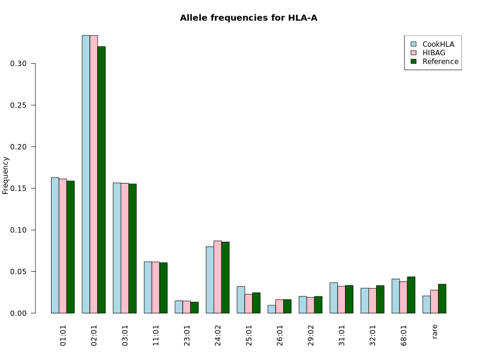
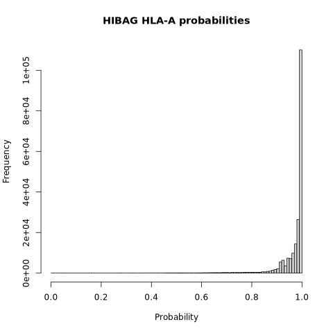
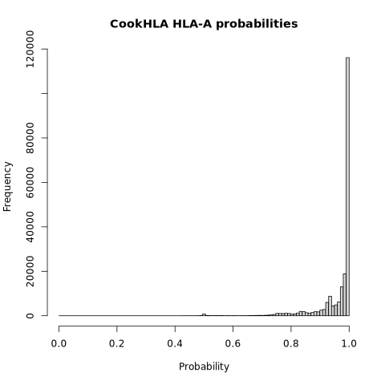
### HLA-B
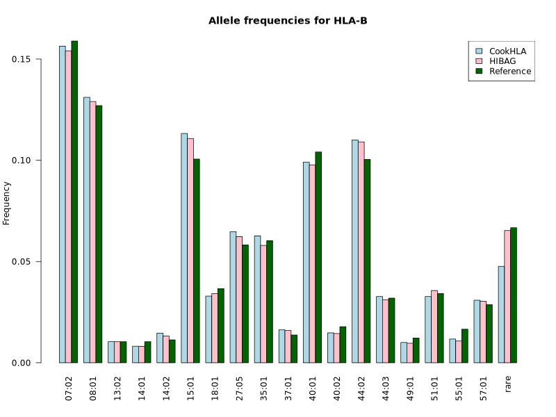
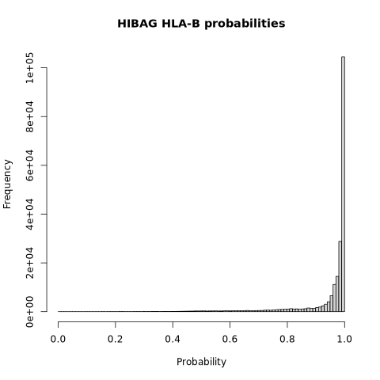
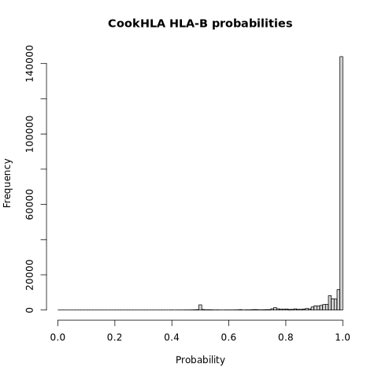
### HLA-C
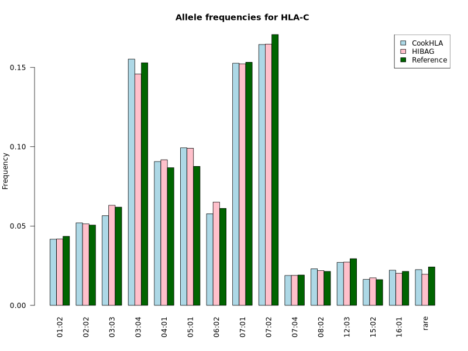
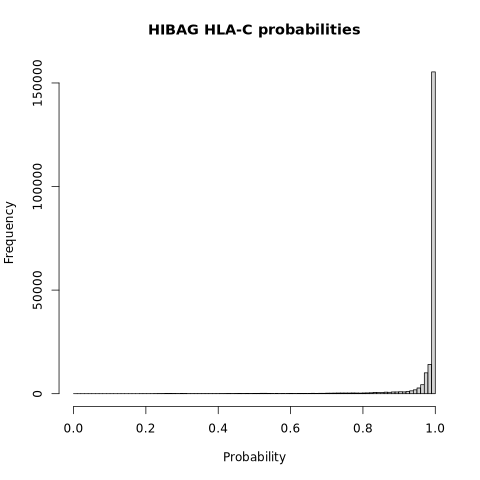
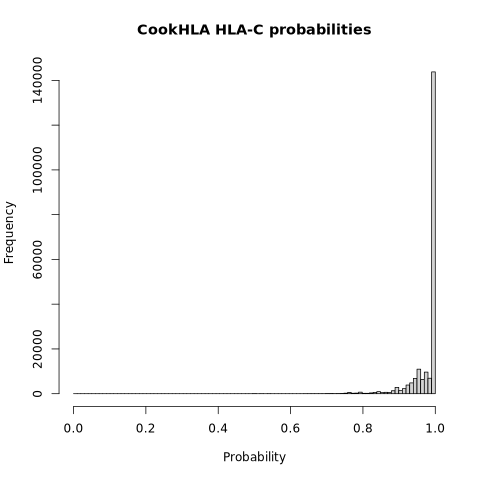
### HLA-DQB1
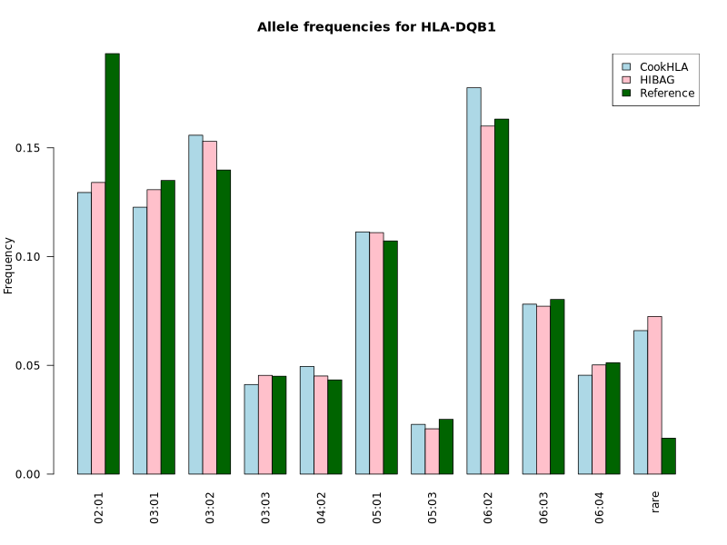
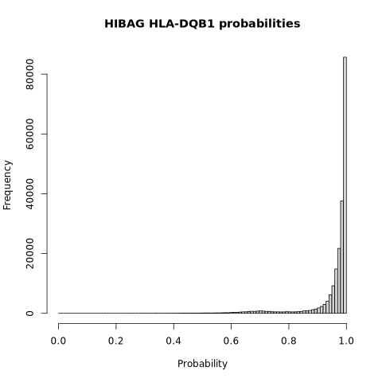
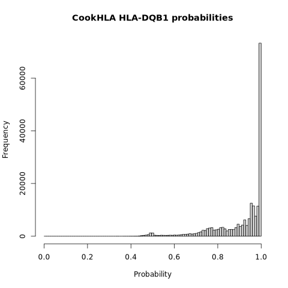
### HLA-DRB1
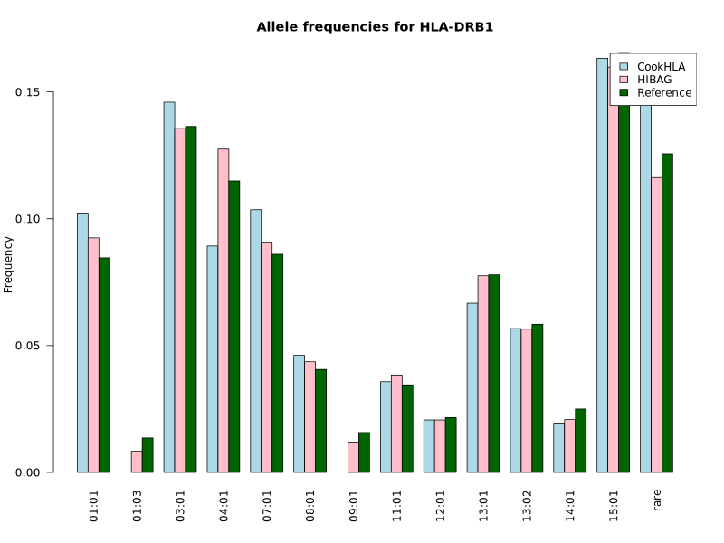
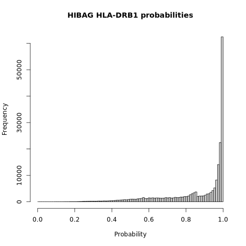
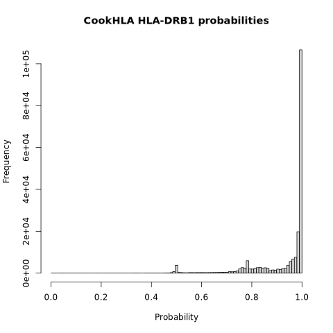
### HLA-DPB1
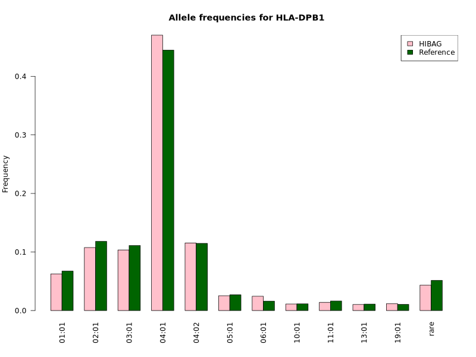
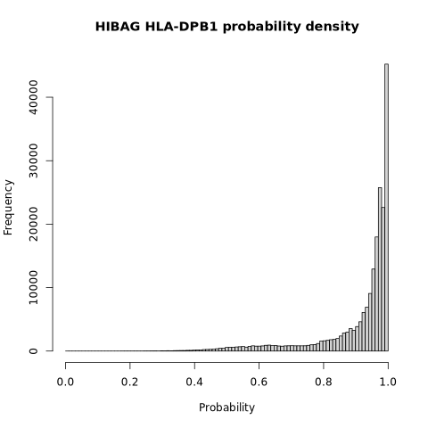
### HLA-DQA1
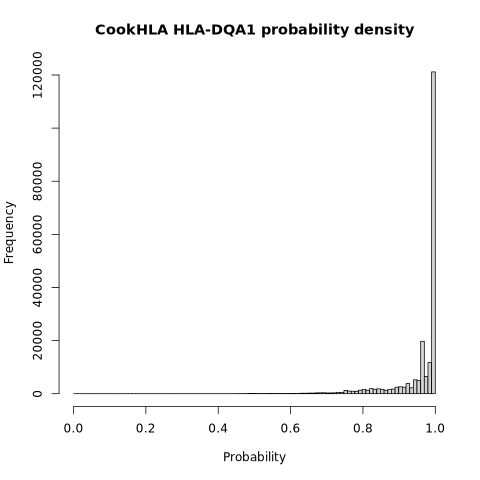
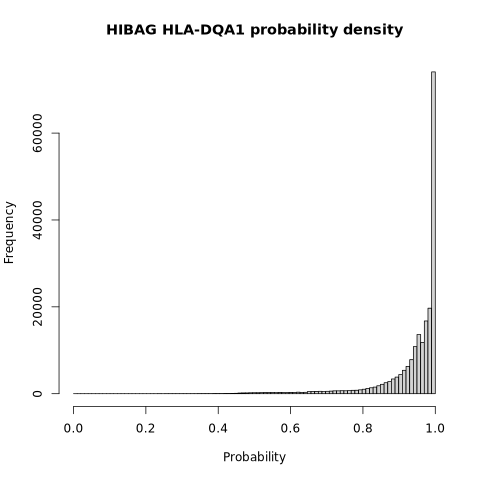
